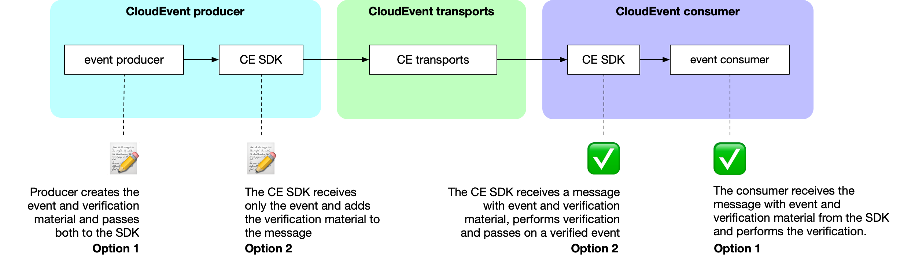

# CloudEvents Verifiability Extension

This proposal introduces a transport protocol agnostic design for verifiable
CloudEvents. It allows producers of CloudEvents to sign the events that they
send and consumers to cryptographically verify the *authenticity and the
integrity* of the events that they receive. Through this process consumers can
be sure that events were in fact produced by the claimed producer
(authenticity), and that the events were received exactly as they were sent,
and not modified in transit (integrity).

The threats addressed by this proposal are those of malicious actors
impersonating CloudEvent producers and of malicious actors modifying messages
in transit.

This proposal only applies to individual events. It does not give consumers any
guarantees about the completeness of the event stream or the order of events.

The threats of malicious actors removing or hiding items from the event stream
as well as swapping their order are not addressed by this proposal. Neither are
the possibilities of messages accidentally getting lost or delivered in the
wrong order. Both can be addressed by producers through means of adding the
necessary information inside the event payloads.

Further, this proposal only aims at *verifiability*. It does not aim to enable
*confidentiality*. Consequently, it does not address the threat of unauthorized
parties reading CloudEvents that were not meant for them.

## Notational Conventions

As with the main [CloudEvents specification](../spec.md), the key words "MUST",
"MUST NOT", "REQUIRED", "SHALL", "SHALL NOT", "SHOULD", "SHOULD NOT",
"RECOMMENDED", "MAY", and "OPTIONAL" in this document are to be interpreted as
described in [RFC 2119](https://tools.ietf.org/html/rfc2119).

However, the scope of these key words is limited to when this extension is
used. For example, an attribute being marked as "REQUIRED" does not mean
it needs to be in all CloudEvents, rather it needs to be included only when
this extension is being used.

## Attributes

### `verificationmaterial` (Verification Material)

- **Type:** `String`
- **Description:**  
  The material consumers use to verify a CloudEvent.  For example, this could
  be a signature of the event generated using a private key. Consumers would
  use the producer’s public key to verify the signature.

  Producers SHOULD avoid relying on canonicalization to minimize the attack
  surface.  Verification material SHOULD be transported in a detached format
  when possible to avoid canonicalization issues.
- **Constraints:**
  - REQUIRED
  - MUST be base64-encoded
  - If present, the `verificationmaterialtype` attribute MUST also be present
  - MUST be transported in the same message as the event
  - MUST NOT appear more than once in the message (duplication of the attribute
    MUST cause failure)
  - If `verificationmaterialtype` is missing, the implementation MUST fail
  - If the verification material is invalid (e.g., does not match the received
    event), the implementation MUST fail
  - If the verification material is of an unknown type, the implementation
    SHOULD fail

### `verificationmaterialtype` (Verification Material Type)

- **Type:** `String`
- **Description:**  
  Indicates the type of verification material.  This high-level category
  informs consumers how to interpret and process the verification material. It
  can include implementation-specific details such as subtype, version
  information, etc.
- **Constraints:**
  - REQUIRED
  - If present, the `verificationmaterial` attribute MUST also be present
  - Producers and consumers MUST agree on the material type to ensure
    successful verification
  - MUST NOT appear more than once in the message (duplication of the attribute
    MUST cause failure)
  - If `verificationmaterial` is missing, the implementation MUST fail
  - If the material type is unknown to the implementation, it MUST fail


## Usage

When this extension is used, producers MUST set both the `verificationmaterial`
and `verificationmaterialtype` attributes. Consumers can choose whether to
perform verification and how to proceed if verification fails.

## Assumptions

This proposal contains a few key assumptions:

1. SDKs will verify as early as possible which depends on the
   verification implementation.
2. Users manage their secrets, e.g. public key infrastructure (PKI).

## Design

Verifiability in CloudEvents consists of two steps:

1. The producer of an event adds verification material to the message
2. The consumer of an event MAY use the verification material to verify the
   authenticity and integrity of the event


The specifics of what the verification material looks like and how the
verification is performed depends on the *verifiability implementation*.

For example, in a public/private key based implementation the producer of an
event would add a signature based on their private key as the verification
material, and the consumer of an event could use the corresponding public key
to check if the signature matches the event.

The flow looks like this:



*Option 1*: useful for verifiability implementations outside of the CE SDK. The
CE SDK merely passes on messages and is not involved in producing verification
material or performing verifications and has no knowledge about the secrets
that the verification is based on (e.g. private keys). Appropriate for tools in
a closed ecosystem like an enterprise system(s) with special requirements that
are not suitable for the CE SDK.

*Option 2*: useful for verifiability implementations that are directly
supported by the CE SDK. The CE SDK has to be provided with the secrets (e.g.
private key for producer and public key for consumers) and will create the
verification material on the producer side and also perform the verification on
the consumer side. This is the appropriate choice for any type of tool that is
used by other entities, for example open source.

**Notes:** If an intermediary party modifies an event, they are considered the
producer of a new event. They MUST create an updated verification material and
the consumer(s) MUST recognize them as a trustworthy producer.

The choice between Option 1 and Option 2 can be made independently by each
system. For example, a producer might follow Option 1 while a consumer uses
Option 2, depending on their requirements and trust boundaries.

## Verifiability Implementation Proposals

A proposal for adding a verifiability implementation to the CE SDK **MUST:**

* provide specs on how to implement verification
* provide test vectors
* provide a verification coverage table (see Verification coverage table)

Test vectors ensure that implementations are consistent which does NOT affect
verifiability. 

A proposal for adding a verifiability implementation to the CE SDK **SHOULD:**

* provide information about how they handle attributes, and if relevant, normalization

## Example

To illustrate, let’s walk through how to implement a verification
implementation

### Verification Implementation

This is an example message containing a CloudEvent directly from the spec. It
happens to be an HTTP structured mode message in JSON format. Our goal is to
come up with the most insecure but also most concise verification
implementation imaginable: one based on a reversed digest which we will call
`rev`!  The `rev` implementation will only verify whether or not the
payload, `data`, is valid and not whether the other context attributes are
valid, for the sake of simplicity.

Here is how a message containing that CloudEvent might look:

```
content-length: 209
content-type: application/json

{
    "specversion" : "1.0",
    "type" : "com.example.someevent",
    "source" : "/mycontext",
    "subject": null,
    "id" : "D234-1234-1234",
    "time" : "2018-04-05T17:31:00Z",
    "data" : "I'm just a string"
}
```

In order to make this event verifiable, the reversed value of the 'data' field
is computed and base64-encoded: `Z25pcnRzIGEgdHN1aiBtJ0kK`.
This value will then be base64 encoded and added as the `verificationmaterial`
context attribute:

```
content-length: 209
content-type: application/json

{
    "specversion" : "1.0",
    "type" : "com.example.someevent",
    "source" : "/mycontext",
    "subject": null,
    "id" : "D234-1234-1234",
    "time" : "2018-04-05T17:31:00Z",
    "data" : "I'm just a string",
    "verificationmaterial": "Z25pcnRzIGEgdHN1aiBtJ0kK",
    "verificationmaterialtype": "rev"
}
```

A consumer then receives this message and in order to verify, they would look
at the `verificationmaterialtype` attribute to determine whether it knows how
to perform the verification. The consumer sees that verification material’s
type is `rev`, so they will compute the `rev` of the payload to verify the
CloudEvent contained in the message:

```
$ echo -n "I'm just a string" | rev
gnirts a tsuj m'I
```

The consumer can then confirm that the verification material matches the rev
output and conclude that the CloudEvent’s authenticity and integrity are
"guaranteed".

Now, since we want to make our fantasy verification implementation into a
proposal to be included in the CE SDK, we will need to define test vectors and
a verification coverage table.

### Test Vectors

An example test vector is defined below:

```
[
    "input": {
        {
            "specversion" : "1.0",
            "type" : "com.example.someevent",
            "source" : "/mycontext",
            "subject": null,
            "id" : "D234-1234-1234",
            "time" : "2018-04-05T17:31:00Z",
            "data" : "I'm just a string"
        }
    },
    "expectedVerificationMaterialType": "rev",
    "expectedVerificationMaterial": "Z25pcnRzIGEgdHN1aiBtJ0kK"
]
```

SDKs and implementers can then use the vectors to ensure that any
implementation is correct and verifiable across different languages and
systems.

### Verification Coverage Table

The table below outlines which parts of a CloudEvent for our imaginary `rev`
based verification implementation would cover:

|Verifiable information	|binary-mode	|structured-mode	|comment	|
|---	|---	|---	|---	|
|data/payload	|✅	|✅	|	|
|mandatory context attributes	|❌	|❌	|The `rev` verification implementation only looks at the payload, not at any context attributes. |
|permissive context attributes	|❌	|❌	|
|extension attributes	|❌	|✅	|

Again, `rev` was chosen because it makes for an easily readable example. It is
wildly insecure and not suitable for actual verifiability. 
