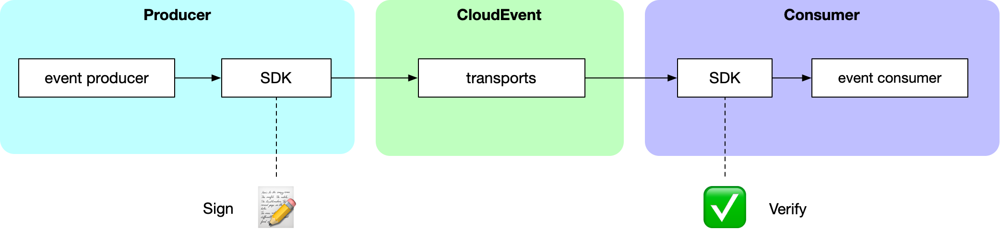
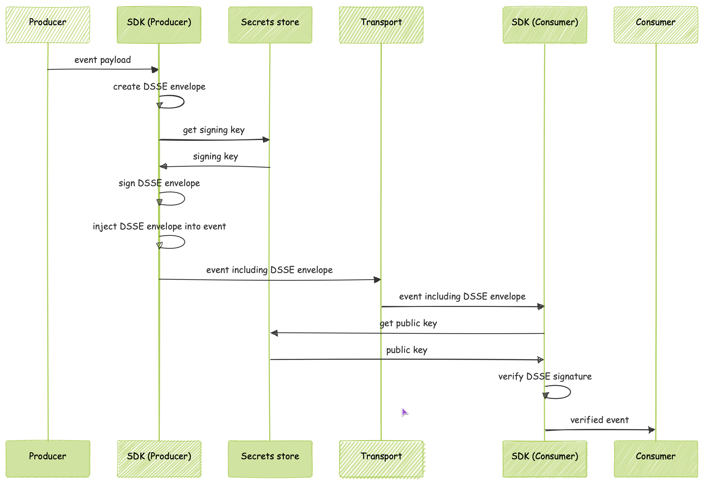
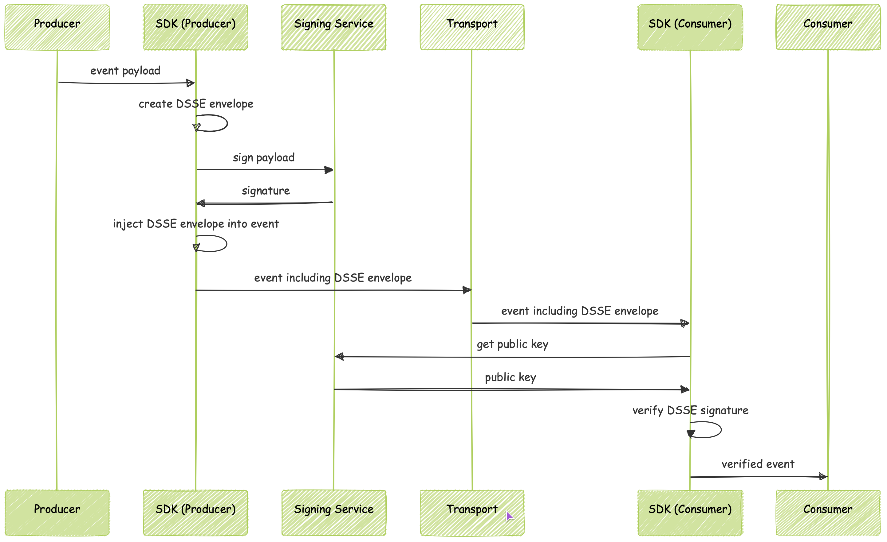
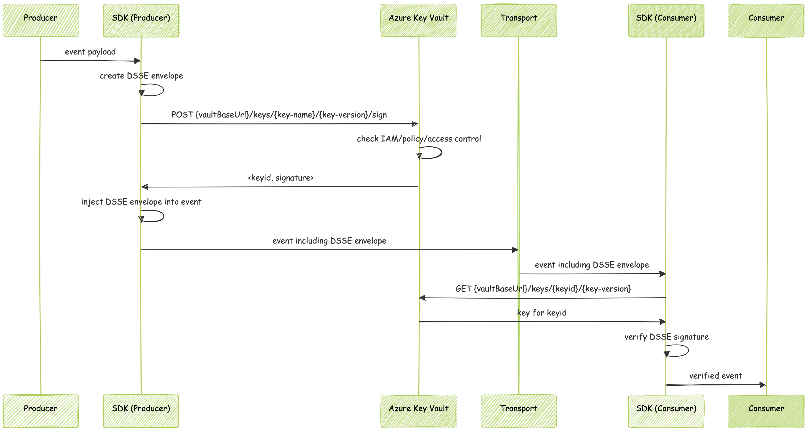

# Proposal: Verifiable CloudEvents with DSSE

## Goals

This proposal introduces a design for verifiable CloudEvents that is agnostic of delivery protocols and event formats.
It allows producers of CloudEvents to sign the events they send, and consumers to cryptographically verify the *authenticity and the integrity* of the events that they receive.
Through this process consumers can be sure that events were in fact produced by the claimed producer (authenticity), and that the events were received exactly as they were sent, and not modified in transit (integrity)—without needing to trust any intermediaries.

The threats addressed by this proposal are those of malicious actors impersonating CloudEvent producers and of malicious actors modifying messages in transit.

With interoperability in mind, this design opts for simplicity and robustness wherever possible.

## Non-goals

This proposal only applies to individual events.
It does not give consumers any guarantees about the completeness of the event stream or the order that events are delivered in.

The threats of a malicious actor preventing events from being delivered or swapping their order are not addressed by this proposal.
Neither are the possibilities of events being accidentally dropped, delivered in the wrong order or the same event being delivered multiple times.
These challenges can be addressed through means of adding the necessary information inside the event payloads.

Because the CloudEvents specification [requires](https://github.com/cloudevents/spec/blob/v1.0.2/cloudevents/spec.md#id) the combination of event `source` and `id` to be unique per event, signature replays for identical events are not considered.

Further, this proposal only aims at *verifiability*.
It does not aim to enable *confidentiality*.
Consequently, it does not address the threat of unauthorized parties being able to read CloudEvents that were not meant for them (see [Privacy & Security](https://github.com/cloudevents/spec/blob/v1.0.2/cloudevents/spec.md#privacy-and-security) in the CloudEvents spec).

While the design in this proposal *can* be used by authorized intermediaries to modify and re-sign events, it explicitly does not aim to provide a cryptographic audit trail of event modifications.

As a general principle, this proposal aims to avoid cryptographic agility in favor of simplicity.

## Constraints

We have set the following constraints for the proposed design:

**Verifiability must be optional:** This ensures that the additional burden of producing verification material and performing verification only applies when verifiability is desired, which is not always the case.

**The design must be backward compatible:** Backward compatibility ensures that producers can produce verifiable events without any knowledge about whether the consumers have been configured to and are able to verify events.
Consumers that do not support verification can consumer signed events as if they were unsigned.

**The verification material must be contained in the same message as the event:** The design aims to be simple and robust, and so the verification material must be transported and delivered along with the event that it describes—and not in separate events or even through different channels.


## Overview

The producer passes a CloudEvent to the SDK, which creates the verification material and adds it to the CloudEvent. When the consumer’s CloudEvents SDK receives a message with event and verification material, it performs a verification of the signature against the key and passes on a verified event to the consumer:



The verification material is transported in an [Extension Context Attribute](https://github.com/cloudevents/spec/blob/main/cloudevents/spec.md#extension-context-attributes) called `dssematerial`:

* Type: `String`
* Description: The [DSSE JSON Envelope](https://github.com/secure-systems-lab/dsse/blob/master/envelope.md) that can be used to verify the authenticity and integrity of CloudEvent.
* Constraints:
    * OPTIONAL
    * If present, must be Base64 encoded

The verification material, once Base64 decoded, looks something like this:

```
{
  "payload": "<Base64(VERIFICATION_MATERIAL)>",
  "payloadType": "https://cloudevents.io/verifiability/dsse/v0.1",
  "signatures": [{
    "keyid": "<KEYID>",
    "sig": "<Base64(SIGNATURE)>"
  }]
}
```

The `payloadType` links to the version of this spec that was used to create the verification material. The spec defines the version of the [DSSE Protocol](https://github.com/secure-systems-lab/dsse/blob/master/protocol.md) that is to be used. 

## Implementation

[Version 1.0.2 of the DSSE Protocol](https://github.com/secure-systems-lab/dsse/blob/v1.0.2/protocol.md) is used for creating and verifying signatures. This proposal intentionally avoids prescribing specific approaches for key management and Public Key Infrastructure (PKI), as these decisions are highly dependent on organizational context, existing security infrastructure, and compliance requirements. Numerous technical solutions exist to make private and public key material available to producers and consumers. 

### Signature

The `VERIFICATION_MATERIAL` of the type `https://cloudevents.io/verifiability/dsse/v0.1` in the envelope above is created as follows:

```
SHA256(
   SHA256(UTF8(event.id)) +
   SHA256(UTF8(event.source)) +
   SHA256(UTF8(event.specversion)) +
   SHA256(UTF8(event.type)) +
   SHA256(UTF8(event.datacontenttype)) +
   SHA256(UTF8(event.dataschema)) +
   SHA256(UTF8(event.subject)) +
   SHA256(RFC3339(UTC(event.time))) +
   SHA256(event.data)
)
```

It is the digest of the concatenated digest list of the mandatory Context Attributes, the optional Context Attributes as well as the event data itself. 

#### Protocol

This is how to sign a CloudEvent using DSSE:

1. choose a signing key
2. create an empty byte sequence
    1. compute the SHA256 digest of the event's [`id`](https://github.com/cloudevents/spec/blob/v1.0.2/cloudevents/spec.md#id) in UTF8 and append it to the byte sequence
    2. compute the SHA256 digest of the event's [`source`](https://github.com/cloudevents/spec/blob/v1.0.2/cloudevents/spec.md#source) Context Attribute in UTF8 and append it to the byte sequence
    3. compute the SHA256 digest of the event's [`specversion`](https://github.com/cloudevents/spec/blob/v1.0.2/cloudevents/spec.md#specversion) Context Attribute in UTF8 and append it to the byte sequence
    4. compute the SHA256 digest of the event's [`type`](https://github.com/cloudevents/spec/blob/v1.0.2/cloudevents/spec.md#type) Context Attribute in UTF8 and append it to the byte sequence
    5. compute the SHA256 digest of the event's [`datacontenttype`](https://github.com/cloudevents/spec/blob/v1.0.2/cloudevents/spec.md#datacontenttype) Context Attribute in UTF8 and append it to the byte sequence *(if the attribute is not set, use the digest of the empty byte sequence)*
    6. compute the SHA256 digest of the event's [`dataschema`](https://github.com/cloudevents/spec/blob/v1.0.2/cloudevents/spec.md#dataschema) Context Attribute in UTF8 and append it to the byte sequence *(if the attribute is not set, use the digest of the empty byte sequence)*
    7. compute the SHA256 digest of the event's [`subject`](https://github.com/cloudevents/spec/blob/v1.0.2/cloudevents/spec.md#subject) Context Attribute in UTF8 and append it to the byte sequence *(if the attribute is not set, use the digest of the empty byte sequence)*
    8. compute the SHA256 digest of the event's [`time`](https://github.com/cloudevents/spec/blob/v1.0.2/cloudevents/spec.md#time) in RFC 3339 Zulu format and append it to the byte sequence *(if the attribute is not set, use the digest of the empty byte sequence)*
    9. compute the SHA256 digest of the event's [`data`](https://github.com/cloudevents/spec/blob/v1.0.2/cloudevents/spec.md#event-data) and append it to the byte sequence
3. compute the SHA256 digest of the byte sequence from `2.`
4. follow the [DSSE protocol v1.0.2](https://github.com/secure-systems-lab/dsse/blob/v1.0.2/protocol.md) to create a signed [DSSE v1.0.2 JSON Envelope](https://github.com/secure-systems-lab/dsse/blob/v1.0.2/envelope.md) using `https://cloudevents.io/verifiability/dsse/v0.1` as `PAYLOAD_TYPE`, the digest from `3.`  as `SERIALIZED_BODY` and an appropriate value for `1.` as `KEYID`
5. encode the envelope from `4.` in Base64 and set it as the `dssematerial` Extension Context Attribute on the CloudEvent
6. ship it!

*Notes:*

* *Base64 as per  [RFC 4648](https://tools.ietf.org/html/rfc4648)*
* *[RFC 3339](https://tools.ietf.org/html/rfc3339)*
* *The time-offset component of the event time's RFC3339 string must be the literal uppercase character `Z` ("Zulu clock time"). Any other valid time-offset, such as +00:00, is disallowed.*
* *In [CloudEvent’s type system](https://github.com/cloudevents/spec/blob/main/cloudevents/spec.md#type-system) a `String` value has a set of character restrictions equivalent to those in [RFC 5198](https://datatracker.ietf.org/doc/html/rfc5198#section-2) (Net-Unicode). We did not find evidence of any CloudEvent SDK doing any NFC/NFD normalization—should this be common in real world deployments, the protocol above might need to prescribe `UTF8(NFC(...))` where it currently simply prescribes `UTF8(...)`.* 

### Verification

When a client verifies an event that it received, it compares the digests of that event’s attributes and data to the signed values in the `VERIFICATION_MATERIAL` . If one of the digests does not match, implementations MUST reject the entire event as unverifiable.

#### Protocol

Here is how to verify a given CloudEvent:

1. obtain list of acceptable signing keys
2. read the event’s `dssematerial` [Extension Context Attribute](https://github.com/cloudevents/spec/blob/main/cloudevents/spec.md#extension-context-attributes)
    1. if it is empty, the event was not signed and MUST be discarded
3. decode the `dssematerial` as Base64 per  [RFC4648](https://tools.ietf.org/html/rfc4648)
    1. if decoding failed, the verification material is corrupted and the event MUST be discarded
4. parse the result into a [JSON DSSE Envelope](https://github.com/secure-systems-lab/dsse/blob/master/envelope.md)
    1. if parsing fails, the verification material is corrupted and the event MUST be discarded
5. follow the [DSSE verification protocol](https://github.com/secure-systems-lab/dsse/blob/master/protocol.md#protocol)
    1. filter signatures by `keyid` from  list of acceptable signing keys
    2. if verification fails, the event MUST be discarded
6. read the envelope’s `payloadType` value
    1. if it is not equal to `https://cloudevents.io/verifiability/dsse/v0.1`, the verification payload is unknown and the event MUST be discarded
7. read the envelope’s `payload` field and Base64 decode it into a byte sequence
    1. if the result is not an sequence of the length 32, then the verification payload is corrupted and the event MUST be discarded
8. create verification material from the event according to the signing [Protocol](#protocol)
9. compare the newly created verification material to that in the envelope
    1. if the values are not equal, the event has been modified in transit and MUST be discarded
10. the event is returned as verified successfully.

Upon verification of an CloudEvent, implementations MUST return a new event containing only verified data: the Context Attributes (required and optional) plus the event data. Extension Context Attributes MUST NOT be included in the verified event. This ensures clear separation between verified and unverified data. Users handle either a complete unverified event or a verified event with only verified values—never a mixture of both.

### What’s verifiable and what isn’t?

Depending on how a CloudEvent is transported—in a [binary-mode, structured-mode or batch-mode](https://github.com/cloudevents/spec/blob/main/cloudevents/spec.md#message) CloudEvent message—different data can be verified:

|Verifiable information	|binary-mode	|structured-mode	|batch-mode	|comment	|
|---	|---	|---	|---	|---	|
|Event Data (payload)	|✅	|✅	|✅	|	|
|REQUIRED Context Attributes	|✅	|✅	|✅	|	|
|OPTIONAL Context Attributes	|✅	|✅	|✅	|See notes below for time attribute	|
|Extension Context Attributes	|❌	|❌	|❌	|	|
|Metadata added by transports	|❌	|❌	|❌	|	|

*Notes:* 

* *In [CloudEvent’s type system](https://github.com/cloudevents/spec/blob/main/cloudevents/spec.md#type-system) a `Timestamp`’s string encoding is [RFC 3339](https://tools.ietf.org/html/rfc3339). This means that verification of the `time` Context Attribute can only be done with second precision, even though an SDK might allow passing in a timestamp with nanosecond precision.*
* *In [CloudEvent’s official Protocol Buffers format](https://github.com/cloudevents/spec/blob/v1.0.2/cloudevents/formats/cloudevents.proto#L57), the `time` Context Attribute is encoded as a `google.protobuf.Timestamp` and hence does not include time zone information (which RFC 3339 would allow). For interoperability with CloudEvent setups using the Protocol Buffers format, time zone information is ignored in the signing and verification process.*
* *Contrary to all other CloudEvent SDKs, the Javascript SDK returns the current time instead of  an empty or null value when a CloudEvent has no `time` Context Attribute. Consequently, signed CloudEvents without time information will not be verifiable in the Javascript SDK.*

## Examples

These example use the same [Cryptographic keys](#cryptographic-keys) as in the [Test Vectors](#test-vectors) and show what a HTTP request to submit an event in its unsigned and signed flavors might look like.

### Structured mode

#### Unverifiable (unsigned) event

```
POST /events HTTP/1.1
Host: api.example.com
Content-Type: application/json
Content-Length: 178

{
  "specversion" : "1.0",
  "id" : "1",
  "source" : "example/uri",
  "type" : "example.type",
  "datacontenttype" : "application/json",
  "data" : {
    "hello" : "world"
  }
}
```

#### Verifiable (signed) event

```
POST /events HTTP/1.1
Host: api.example.com
Content-Type: application/json
Content-Length: 541

{
  "specversion" : "1.0",
  "id" : "1",
  "source" : "example/uri",
  "type" : "example.type",
  "datacontenttype" : "application/json",
  "data" : {
    "hello" : "world"
  },
  "dssematerial" : "eyJwYXlsb2FkVHlwZSI6Imh0dHBzOi8vY2xvdWRldmVudHMuaW8vdmVyaWZpYWJpbGl0eS9kc3NlL3YwLjEiLCJwYXlsb2FkIjoiNXh6NS9WdG94TkpWWWFZeG1MZUw2eEw5STZDYXY5UDNnb2g2cXlDWUdmUT0iLCJzaWduYXR1cmVzIjpbeyJrZXlpZCI6InRlc3RrZXkiLCJzaWciOiJ3WWo4YlJQWFlDSUxyeXdzUDdXR1VCd1RKc25aSFlYTUhpWEZtWWh1QkdhOU1ocDdYNHZFN1FBYkhXbytXZitjTURBYjN6dXlwRjVVbVdwZGtJUGppUT09In1dfQ=="
}
```

### Binary mode

#### Unverifiable (unsigned) event

```
POST /events HTTP/1.1
Host: api.example.com
Content-Type: application/json
Content-Length: 25
ce-specversion: 1.0
ce-id: 1
ce-source: example/uri
ce-type: example.type
ce-datacontenttype: application/json

{
    "hello" : "world"
}
```

#### Verifiable (signed) event

```
POST /events HTTP/1.1
Host: api.example.com
Content-Type: application/json
Content-Length: 25
ce-specversion: 1.0
ce-id: 1
ce-source: example/uri
ce-type: example.type
ce-datacontenttype: example/type
ce-dssematerial: eyJwYXlsb2FkVHlwZSI6Imh0dHBzOi8vY2xvdWRldmVudHMuaW8vdmVyaWZpYWJpbGl0eS9kc3NlL3YwLjEiLCJwYXlsb2FkIjoiNXh6NS9WdG94TkpWWWFZeG1MZUw2eEw5STZDYXY5UDNnb2g2cXlDWUdmUT0iLCJzaWduYXR1cmVzIjpbeyJrZXlpZCI6InRlc3RrZXkiLCJzaWciOiJ3WWo4YlJQWFlDSUxyeXdzUDdXR1VCd1RKc25aSFlYTUhpWEZtWWh1QkdhOU1ocDdYNHZFN1FBYkhXbytXZitjTURBYjN6dXlwRjVVbVdwZGtJUGppUT09In1dfQ==

{
    "hello" : "world"
}
```

## Test Vectors

Due to the programming language agnostic nature of CloudEvents, the following test vectors ensure compatibility between implementations in different languages. We use the following cryptographic keys for all cases:

##### *Cryptographic keys*

```
Algorithm: ECDSA over NIST P-256 and SHA-256, with deterministic-rfc6979
Signature: raw concatenation of r and s (Cryptodome binary encoding)
X: 46950820868899156662930047687818585632848591499744589407958293238635476079160
Y: 5640078356564379163099075877009565129882514886557779369047442380624545832820
d: 97358161215184420915383655311931858321456579547487070936769975997791359926199
```

#### Digest algorithm: SHA256

The events for the following cases are expressed in [*JSON Format*](https://github.com/cloudevents/spec/blob/main/cloudevents/formats/json-format.md) for readability, but they apply to all [CloudEvents Formats](https://github.com/cloudevents/spec/tree/main/cloudevents/formats).

#### Case 1: Event without time

*Input: CloudEvent* 

```
{
  "specversion" : "1.0",
  "id" : "1",
  "source" : "example/uri",
  "type" : "example.type",
  "datacontenttype" : "application/json",
  "data" : {
    "hello" : "world"
  }
}
```

*Output: verification material:* 

```
eyJwYXlsb2FkVHlwZSI6Imh0dHBzOi8vY2xvdWRldmVudHMuaW8vdmVyaWZpYWJpbGl0eS9kc3NlL3YwLjEiLCJwYXlsb2FkIjoiNXh6NS9WdG94TkpWWWFZeG1MZUw2eEw5STZDYXY5UDNnb2g2cXlDWUdmUT0iLCJzaWduYXR1cmVzIjpbeyJrZXlpZCI6InRlc3RrZXkiLCJzaWciOiJ3WWo4YlJQWFlDSUxyeXdzUDdXR1VCd1RKc25aSFlYTUhpWEZtWWh1QkdhOU1ocDdYNHZFN1FBYkhXbytXZitjTURBYjN6dXlwRjVVbVdwZGtJUGppUT09In1dfQ==
```

#### Case 2: Event with empty subject

*Input: CloudEvent* 

```
{
  "specversion" : "1.0",
  "id" : "1",
  "source" : "example/uri",
  "subject": "",
  "type" : "example.type",
  "datacontenttype" : "application/json",
  "data" : {
    "hello" : "world"
  }
}
```

*Output: verification material:* 

```
eyJwYXlsb2FkVHlwZSI6ImFwcGxpY2F0aW9uL3ZuZC5jbG91ZGV2ZW50cytqc29uIiwicGF5bG9hZCI6ImV5SmthV2RsYzNSeklqcGJJbUUwWVhsakx6Z3dMMDlIWkdFMFFrOHZNVzh2VmpCbGRIQlBjV2xNZURGS2QwSTFVek5pWlVoWE1ITTlJaXdpVlVzeFYwVmpVM1Z1Y2tZNVFua3pOSEZFVlU5dWRXSndXR1Y1Tm1JeE1rOUxMMVJaVFRSU01rOVNSVDBpTENJd1VEbGFaRXhoY1ZWek9WZExLM0JhU1ZsUlRVRjVjVWREY0VkcVZWTTVMelpRWkc4NWNuWm5RbVpaUFNJc0lsUjNTVU5ZTW5WM2VXOTRUVlZUWWxrd1Mxb3hUelEzVTBkd0wxZHBZbVkyTm1WbFJrUndPV0YyVm1jOUlpd2lkWE4wTW0wd1lqSXdWMjQzU1c0MlowcHNWVkJSVWpGSGVTdGFjVzVEY0hKdk1sSktlVTByVDFSbGJ6MGlMQ0kwTjBSRlVYQnFPRWhDVTJFckwxUkpiVmNyTlVwRFpYVlJaVkpyYlRWT1RYQktWMXBITTJoVGRVWlZQU0lzSWpRM1JFVlJjR280U0VKVFlTc3ZWRWx0VnlzMVNrTmxkVkZsVW10dE5VNU5jRXBYV2tjemFGTjFSbFU5SWl3aU5EZEVSVkZ3YWpoSVFsTmhLeTlVU1cxWEt6VktRMlYxVVdWU2EyMDFUazF3U2xkYVJ6Tm9VM1ZHVlQwaUxDSnJOa2sxWTJGclZUVmxja3c0UzJwVFZWWlVUbTkzYmtSM1kyTjJkVFZyVlRGSWVHYzRPSFJ2UmxsblBTSmRmUT09Iiwic2lnbmF0dXJlcyI6W3sia2V5aWQiOiJmM2VkOTdkNTM3NzRjNjk3NDFkY2FiZjllOTc4NWNlZjZlMGY1ODk5NWM4Njk2OGJjMTRiODE2YTg5OWE4YTQ1Iiwic2lnIjoiTUVVQ0lBaHRMQ1JnZEd4QjUva2ZhY3YzWi9RZzAyN0VuVG9abnI2K2JLTWp6dHpKQWlFQWcxM3NSbEhCb2lsamU4VUxyNFBVL0lPbkl5L3JsSkd4Rm9QbUlhdU5SQ0U9In1dfQ==
```

Even though not strictly a valid CloudEvent (optional Context Attributes must be the non empty string when present), CloudEvents SDKs might allow users to set empty strings regardless. This test vector accounts for that possibility and ensures correct implementation of this spec.

#### Case 3: Event with zulu time

*Input: CloudEvent* 

```
{
  "specversion" : "1.0",
  "id" : "1",
  "source" : "example/uri",
  "subject": "",
  "type" : "example.type",
  "datacontenttype" : "application/json",
  "time": "2020-06-18T17:24:53Z",
  "data" : {
    "hello" : "world"
  }
}
```

*Output: verification material:* 

```
eyJwYXlsb2FkVHlwZSI6ImFwcGxpY2F0aW9uL3ZuZC5jbG91ZGV2ZW50cytqc29uIiwicGF5bG9hZCI6ImV5SmthV2RsYzNSeklqcGJJbUUwWVhsakx6Z3dMMDlIWkdFMFFrOHZNVzh2VmpCbGRIQlBjV2xNZURGS2QwSTFVek5pWlVoWE1ITTlJaXdpVlVzeFYwVmpVM1Z1Y2tZNVFua3pOSEZFVlU5dWRXSndXR1Y1Tm1JeE1rOUxMMVJaVFRSU01rOVNSVDBpTENJd1VEbGFaRXhoY1ZWek9WZExLM0JhU1ZsUlRVRjVjVWREY0VkcVZWTTVMelpRWkc4NWNuWm5RbVpaUFNJc0lsUjNTVU5ZTW5WM2VXOTRUVlZUWWxrd1Mxb3hUelEzVTBkd0wxZHBZbVkyTm1WbFJrUndPV0YyVm1jOUlpd2lkWE4wTW0wd1lqSXdWMjQzU1c0MlowcHNWVkJSVWpGSGVTdGFjVzVEY0hKdk1sSktlVTByVDFSbGJ6MGlMQ0kwTjBSRlVYQnFPRWhDVTJFckwxUkpiVmNyTlVwRFpYVlJaVkpyYlRWT1RYQktWMXBITTJoVGRVWlZQU0lzSWpRM1JFVlJjR280U0VKVFlTc3ZWRWx0VnlzMVNrTmxkVkZsVW10dE5VNU5jRXBYV2tjemFGTjFSbFU5SWl3aU5EZEVSVkZ3YWpoSVFsTmhLeTlVU1cxWEt6VktRMlYxVVdWU2EyMDFUazF3U2xkYVJ6Tm9VM1ZHVlQwaUxDSnJOa2sxWTJGclZUVmxja3c0UzJwVFZWWlVUbTkzYmtSM1kyTjJkVFZyVlRGSWVHYzRPSFJ2UmxsblBTSmRmUT09Iiwic2lnbmF0dXJlcyI6W3sia2V5aWQiOiJmM2VkOTdkNTM3NzRjNjk3NDFkY2FiZjllOTc4NWNlZjZlMGY1ODk5NWM4Njk2OGJjMTRiODE2YTg5OWE4YTQ1Iiwic2lnIjoiTUVVQ0lBaHRMQ1JnZEd4QjUva2ZhY3YzWi9RZzAyN0VuVG9abnI2K2JLTWp6dHpKQWlFQWcxM3NSbEhCb2lsamU4VUxyNFBVL0lPbkl5L3JsSkd4Rm9QbUlhdU5SQ0U9In1dfQ==
```

#### Case 4: Event with time including TZ

*Input: CloudEvent* 

```
{
  "specversion" : "1.0",
  "id" : "1",
  "source" : "example/uri",
  "subject": "",
  "type" : "example.type",
  "datacontenttype" : "application/json",
  "time": "2020-06-18T19:24:53+02:00",
  "data" : {
    "hello" : "world"
  }
}
```

*Output: verification material:* 

```
eyJwYXlsb2FkVHlwZSI6ImFwcGxpY2F0aW9uL3ZuZC5jbG91ZGV2ZW50cytqc29uIiwicGF5bG9hZCI6ImV5SmthV2RsYzNSeklqcGJJbUUwWVhsakx6Z3dMMDlIWkdFMFFrOHZNVzh2VmpCbGRIQlBjV2xNZURGS2QwSTFVek5pWlVoWE1ITTlJaXdpVlVzeFYwVmpVM1Z1Y2tZNVFua3pOSEZFVlU5dWRXSndXR1Y1Tm1JeE1rOUxMMVJaVFRSU01rOVNSVDBpTENJd1VEbGFaRXhoY1ZWek9WZExLM0JhU1ZsUlRVRjVjVWREY0VkcVZWTTVMelpRWkc4NWNuWm5RbVpaUFNJc0lsUjNTVU5ZTW5WM2VXOTRUVlZUWWxrd1Mxb3hUelEzVTBkd0wxZHBZbVkyTm1WbFJrUndPV0YyVm1jOUlpd2lkWE4wTW0wd1lqSXdWMjQzU1c0MlowcHNWVkJSVWpGSGVTdGFjVzVEY0hKdk1sSktlVTByVDFSbGJ6MGlMQ0kwTjBSRlVYQnFPRWhDVTJFckwxUkpiVmNyTlVwRFpYVlJaVkpyYlRWT1RYQktWMXBITTJoVGRVWlZQU0lzSWpRM1JFVlJjR280U0VKVFlTc3ZWRWx0VnlzMVNrTmxkVkZsVW10dE5VNU5jRXBYV2tjemFGTjFSbFU5SWl3aU5EZEVSVkZ3YWpoSVFsTmhLeTlVU1cxWEt6VktRMlYxVVdWU2EyMDFUazF3U2xkYVJ6Tm9VM1ZHVlQwaUxDSnJOa2sxWTJGclZUVmxja3c0UzJwVFZWWlVUbTkzYmtSM1kyTjJkVFZyVlRGSWVHYzRPSFJ2UmxsblBTSmRmUT09Iiwic2lnbmF0dXJlcyI6W3sia2V5aWQiOiJmM2VkOTdkNTM3NzRjNjk3NDFkY2FiZjllOTc4NWNlZjZlMGY1ODk5NWM4Njk2OGJjMTRiODE2YTg5OWE4YTQ1Iiwic2lnIjoiTUVVQ0lBaHRMQ1JnZEd4QjUva2ZhY3YzWi9RZzAyN0VuVG9abnI2K2JLTWp6dHpKQWlFQWcxM3NSbEhCb2lsamU4VUxyNFBVL0lPbkl5L3JsSkd4Rm9QbUlhdU5SQ0U9In1dfQ==
```

The verification material must be the same as in case 3, because `2020-06-18T17:24:53Z` and `2020-06-18T19:24:53+02:00` are the same moment in time and the verification protocol performs time zone normalization.


#### Case 5: Binary data

*Input: CloudEvent* 

```
{
  "specversion" : "1.0",
  "id" : "1",
  "source" : "example/uri",
  "type" : "example.type.binary",
  "datacontenttype" : "application/octet-stream",
  "data_base64" : "8J+koQ=="
}
```

*Output: verification material:* 

```
eyJwYXlsb2FkVHlwZSI6Imh0dHBzOi8vY2xvdWRldmVudHMuaW8vdmVyaWZpYWJpbGl0eS9kc3NlL3YwLjEiLCJwYXlsb2FkIjoicUNTZWlaa1MraEg5V2lDbGZxNnBsZnFZTlZ5Mmt2eFdSZm9CckxFem9Eaz0iLCJzaWduYXR1cmVzIjpbeyJrZXlpZCI6InRlc3RrZXkiLCJzaWciOiJEWXdiU3V4SDRXcWFhQlZPVlU4TllJYTZXYnZDazkvdkc5aGV0d3BKNHpJNWo2am1BTGRNaHcrcVZuc211YzY2NWZqVlJGVDFRUHUvanA1Z0c0U2pzUT09In1dfQ==
```

## Appendix

### Updates to the spec

As mentioned in the [Goals](#goals) section, a goal for this design was simplicity.
It's therefore also prescriptive, for example in the digest algorithm used or in the data covered by the signature.
When a change becomes necessary (for example replacing SHA256 with something else), an updated version of the spec will be published.

Implementations can then be updated according to the changes in the spec.
SDKs can support verifying events signed according to previous versions of the spec in addition to the current one.

Updating a deployment from one version of the spec to another can be done by first updating all consumers, adding support for the new version of the spec (in addition to the previous version). Then, the producers can be updated to sign events according to the new version of the spec.

### Key management

Key management for signed CloudEvents involves choosing between local signing and remote signing approaches, each with distinct operational trade-offs and trust boundaries. 

#### Local signing



*Local signing* loads private keys from key management systems directly into the producer's runtime, maintaining full cryptographic control within the organization's security perimeter but requiring secure key distribution and complicating lifecycle management across multiple signing nodes.

#### Remote signing



*Remote signing* delegates cryptographic operations to a dedicated service (even backed by HSMs) that holds the keys, centralizing trust and reducing attack surface on event producers while providing audit trails and simplified key rotation.

#### Consumer

One requirement that both approaches—local signing and remote signing—have in common is, that a consumer must be able to determine not just whether a signature matches a given key, but also that the key from the signature is acceptable.

For example when a consumer receive a signed CloudEvent from their SCM system and inspects the DSSE envelope’s signature, it will need get the key for the given `keyid` and also make sure that this key is in fact belongs to the SCM system, and not to a malicious actor. 

How this works concretely depends on the software stack used for key management. For example, a consumer might ask a key management system for the currently correct key that belongs to the producer of the CloudEvent as well as the type of the CloudEvent. The right architecture depends on your use case and its requirements.

#### Rotation

The specific mechanisms for key rotation are implementation-dependent and subject to the constraints of the underlying public key infrastructure. In most cases, this involves generating a new key pair and publishing the new public key through established certificate distribution channels.

### Azure KMS example (remote signing)



The producer could use the CloudEvent source to determine the `key-name` to use for signing. Similarly, the consumer can use the `key-name` to fetch the (currently) valid key to verify events for that producer. Other examples would be the event type, `context.source` combinations thereof, etc. if different signing keys for different components of the same service are desired.
