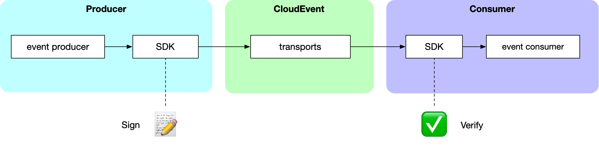
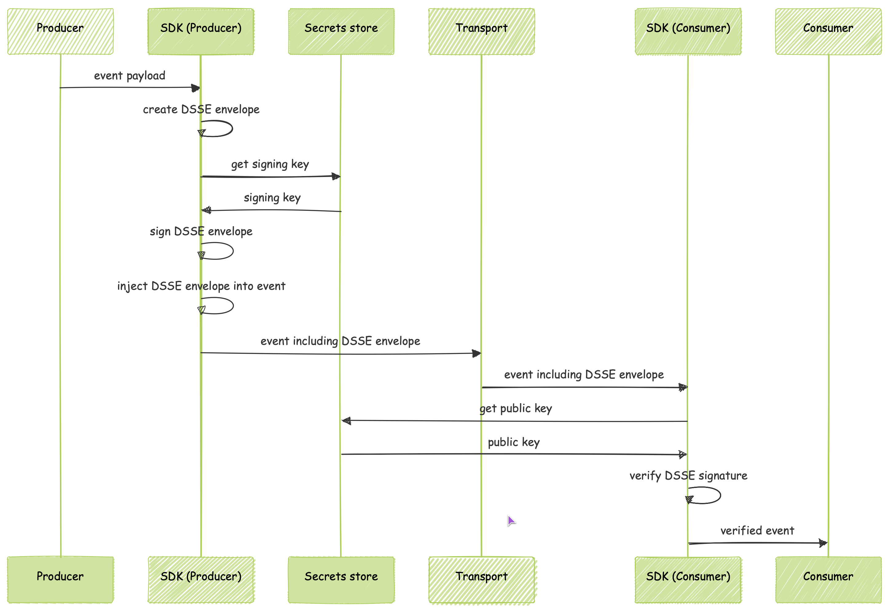
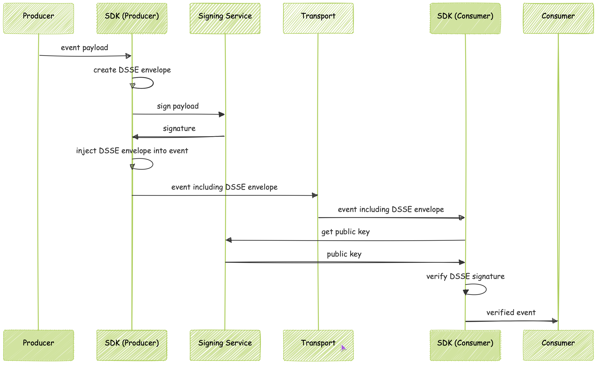
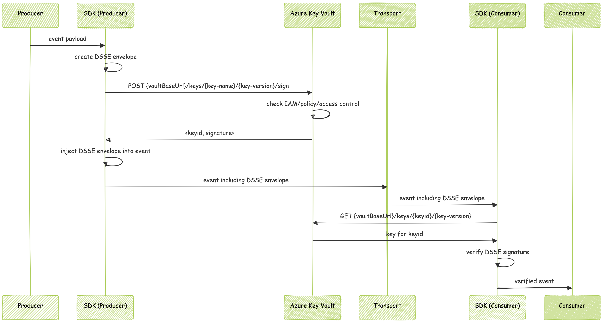

# extension: Verifiable CloudEvents with DSSE

## Goals

This extension introduces a design for verifiable CloudEvents that is agnostic
of delivery protocols and event formats. It allows producers of CloudEvents to
sign the events they send, and consumers to cryptographically verify the
*authenticity and the integrity* of the events that they receive. Through this
process consumers can be sure that events were in fact produced by the claimed
producer (authenticity), and that the events were received exactly as they were
sent, and not modified in transit (integrity) without needing to trust any
intermediaries.

The threats addressed by this extension are those of malicious actors
impersonating CloudEvent producers and of malicious actors modifying messages
in transit.

With interoperability in mind, this design opts for simplicity and robustness
wherever possible.

## Non-goals

This extension only applies to individual events. It does not give consumers
any guarantees about the completeness of the event stream or the order in
which events are delivered. Solutions for these other issues are outside the
scope of this proposal.

Because the CloudEvents specification [requires](https://github.com/cloudevents/spec/blob/v1.0.2/cloudevents/spec.md#id)
the combination of event `source` and `id` to be unique per event, signature
replay attacks (where an attacker resubmits a legitimately signed event) are
out of scope for this proposal - the existing source+id uniqueness requirement
provides sufficient protection.


Further, this extension only aims at *verifiability*. It does not aim to
enable *confidentiality*. Consequently, it does not address the threat of
unauthorized parties being able to read CloudEvents that were not meant for
them (see [Privacy & Security](https://github.com/cloudevents/spec/blob/v1.0.2/cloudevents/spec.md#privacy-and-security)
in the CloudEvents spec).

While the design in this extension *can* be used by authorized intermediaries
to modify and re-sign events, it explicitly does not aim to provide a
cryptographic audit trail of event modifications.

As a general principle, this extension aims to avoid cryptographic agility in
favor of simplicity.

## Constraints

The following constraints apply to the proposed design:

**Verifiability MUST be OPTIONAL:** This ensures that the additional burden of
producing verification material and performing verification only applies when
verifiability is desired, which is not always the case. Consumers that don't
understand or care about signatures can simply ignore these extension fields
and process events normally.

**The design MUST be backward compatible:** Backward compatibility ensures that
producers can produce verifiable events without any knowledge about whether the
consumers have been configured to and are able to verify events. Consumers
that do not support verification can consume signed events as if they were
unsigned.

**The verification material MUST be contained in the same message as the
event:** The design aims to be simple and robust, and so the verification
material MUST be transported and delivered along with the event that it
describes and not in separate events or even through different channels.


## Overview

This extension enables event producers to sign CloudEvents and consumers to
verify those signatures. The verification material is transported in an
extension attribute alongside the event data.


In a typical flow (using an SDK):
The producer passes a CloudEvent to the SDK, which creates the verification
material and adds it to the CloudEvent. When the consumer's CloudEvents SDK
receives a message with event and verification material, it performs a
verification of the signature against the key and passes on a verified event to
the consumer:



The verification material is transported in an [Extension Context Attribute](https://github.com/cloudevents/spec/blob/main/cloudevents/spec.md#extension-context-attributes)
called `dssematerial` (see [Attributes](#attributes) section below).

The verification material, once Base64 decoded, MUST be a proper DSSE envelope:

```
{
 "payload": "<Base64(VERIFICATION_MATERIAL)>",
 "payloadType": "https://cloudevents.io/verifiability/dsse/v0.1",
 "signatures": [{
  "keyid": "<KEYID>",
  "sig": "<Base64(SIGNATURE)>"
 }]
}
```

The `VERIFICATION_MATERIAL`, once Base64 decoded, MUST be a JSON object:

```
{
 "core": "<Base64(core_digest)>",
 "ext":  "<Base64(ext_digest)>",
 "signedextattrs": ["exta", "extb"]
}
```

Where `core_digest` is a 32-byte SHA256 digest of the core CloudEvent fields and
`ext_digest` is a 32-byte SHA256 digest of the signed extension attribute values.
The `ext` and `signedextattrs` fields are OPTIONAL: they MUST both be present
when extension attributes are signed, and MUST both be absent otherwise.

The `payloadType` links to the version of this spec that was used to create the
verification material. The spec defines the version of the [DSSE Protocol](https://github.com/secure-systems-lab/dsse/blob/master/protocol.md)
that is to be used.

## Attributes

This extension defines the following attribute:

### dssematerial
- Type: `String`
- Description: The [DSSE JSON Envelope](https://github.com/secure-systems-lab/dsse/blob/master/envelope.md)
  that can be used to verify the authenticity and integrity of the CloudEvent.
- Constraints:
  - OPTIONAL
  - If present, MUST be Base64 encoded
  - When decoded, MUST be a valid DSSE JSON Envelope with:
    - `payloadType` of `"https://cloudevents.io/verifiability/dsse/v0.1"`
    - `payload` containing a Base64-encoded JSON object with:
      - `core`: Base64-encoded 32-byte SHA256 digest of the core CloudEvent fields (REQUIRED)
      - `ext`: Base64-encoded 32-byte SHA256 digest of the signed extension attribute values (OPTIONAL)
      - `signedextattrs`: JSON array of extension attribute name strings that were signed (OPTIONAL)
      - `ext` and `signedextattrs` MUST both be present or both be absent
      - The `signedextattrs` array MUST adhere to the following rules. If any of these rules are violated, the signing function MUST refuse to produce material and the verifier MUST discard the event:
        - Attribute names MUST NOT contain repetitions
        - Attribute names MUST NOT include any required or optional [Context Attribute](https://github.com/cloudevents/spec/blob/main/cloudevents/spec.md#context-attributes) name (`id`, `source`, `specversion`, `type`, `datacontenttype`, `dataschema`, `subject`, `time`)
        - Attribute names MUST NOT include `dssematerial` (the verification material attribute)
    - `signatures` array with at least one signature object containing `keyid` and `sig` fields

## Implementation

[Version 1.0.2 of the DSSE Protocol](https://github.com/secure-systems-lab/dsse/blob/v1.0.2/protocol.md)
is used for creating and verifying signatures. This extension intentionally
avoids prescribing specific approaches for key management and Public Key
Infrastructure (PKI), as these decisions are highly dependent on organizational
context, existing security infrastructure, and compliance requirements.
Numerous technical solutions exist to make private and public key material
available to producers and consumers.

### Signature

The `VERIFICATION_MATERIAL` of the type
`https://cloudevents.io/verifiability/dsse/v0.1` in the envelope above is
a JSON object created as follows:

```
core_digest = SHA256(
  SHA256(UTF8(event.id)) +
  SHA256(UTF8(event.source)) +
  SHA256(UTF8(event.specversion)) +
  SHA256(UTF8(event.type)) +
  SHA256(UTF8(event.datacontenttype)) +
  SHA256(UTF8(event.dataschema)) +
  SHA256(UTF8(event.subject)) +
  SHA256(RFC3339(UTC(event.time))) +
  SHA256(event.data)
)

ext_digest = SHA256(
  SHA256(event.extensionattr1) +
  SHA256(event.extensionattr2)
)

VERIFICATION_MATERIAL = {
  "core": Base64(core_digest),
  "ext":  Base64(ext_digest),          // omitted if no extension attributes are signed
  "signedextattrs": ["extensionattr1", "extensionattr2"]  // omitted if no extension attributes are signed
}
```

`core_digest` is the digest of the concatenated digest list of the mandatory
Context Attributes, the OPTIONAL Context Attributes, and the event data.
`ext_digest` is the digest of the concatenated value digest list of the
signed extension attributes. The extension attribute names are authenticated
by being included in the `signedextattrs` array inside the signed container.
The `ext` and `signedextattrs` fields are only present when extension
attributes are signed.

#### Protocol

This is how to sign a CloudEvent using DSSE:

1. choose a signing key
2. choose the list of "signed extension attributes" (the list MUST adhere to the constraints defined in the [`dssematerial`](#dssematerial) attribute definition: no repetitions, no Context Attribute names, and no `dssematerial`)
3. create an empty byte sequence for the core digest
    1. compute the SHA256 digest of the event's [`id`](https://github.com/cloudevents/spec/blob/v1.0.2/cloudevents/spec.md#id) in UTF8 and append it to the byte sequence *(if the attribute is not set, use the digest of the empty byte sequence)*
    2. compute the SHA256 digest of the event's [`source`](https://github.com/cloudevents/spec/blob/v1.0.2/cloudevents/spec.md#source) Context Attribute in UTF8 and append it to the byte sequence *(if the attribute is not set, use the digest of the empty byte sequence)*
    3. compute the SHA256 digest of the event's [`specversion`](https://github.com/cloudevents/spec/blob/v1.0.2/cloudevents/spec.md#specversion) Context Attribute in UTF8 and append it to the byte sequence *(if the attribute is not set, use the digest of the empty byte sequence)*
    4. compute the SHA256 digest of the event's [`type`](https://github.com/cloudevents/spec/blob/v1.0.2/cloudevents/spec.md#type) Context Attribute in UTF8 and append it to the byte sequence *(if the attribute is not set, use the digest of the empty byte sequence)*
    5. compute the SHA256 digest of the event's [`datacontenttype`](https://github.com/cloudevents/spec/blob/v1.0.2/cloudevents/spec.md#datacontenttype) Context Attribute in UTF8 and append it to the byte sequence *(if the attribute is not set, use the digest of the empty byte sequence)*
    6. compute the SHA256 digest of the event's [`dataschema`](https://github.com/cloudevents/spec/blob/v1.0.2/cloudevents/spec.md#dataschema) Context Attribute in UTF8 and append it to the byte sequence *(if the attribute is not set, use the digest of the empty byte sequence)*
    7. compute the SHA256 digest of the event's [`subject`](https://github.com/cloudevents/spec/blob/v1.0.2/cloudevents/spec.md#subject) Context Attribute in UTF8 and append it to the byte sequence *(if the attribute is not set, use the digest of the empty byte sequence)*
    8. compute the SHA256 digest of the event's [`time`](https://github.com/cloudevents/spec/blob/v1.0.2/cloudevents/spec.md#time) Context Attribute normalized to RFC 3339 Zulu format and append it to the byte sequence (if the attribute is not set, use the digest of the empty byte sequence)
       Note: Time normalization to Zulu format ensures signature verification remains valid even when intermediaries deserialize and reserialize events with different timezone representations of the same timestamp.
    9. compute the SHA256 digest of the event's [`data`](https://github.com/cloudevents/spec/blob/v1.0.2/cloudevents/spec.md#event-data) and append it to the byte sequence
4. compute `core_digest` as the SHA256 digest of the byte sequence from step 3
5. if the list from step 2 is not empty:
    1. create an empty byte sequence for the ext digest
    2. for each extension attribute in the list from step 2 (in the given order, from lowest to highest index)
        1. compute the SHA256 digest of the extension attribute's value and append it to the byte sequence. Non-string attribute values MUST be serialized to their [CloudEvents string representation](https://github.com/cloudevents/spec/blob/main/cloudevents/spec.md#type-system) before hashing. *(if the attribute is not present on the event, use the digest of the empty byte sequence)*
    3. compute `ext_digest` as the SHA256 digest of the byte sequence from step 5.1
6. create the `VERIFICATION_MATERIAL` JSON object:
    - set `core` to the Base64 encoding of `core_digest`
    - if `ext_digest` was computed in step 5, set `ext` to the Base64 encoding of `ext_digest`
    - if `ext_digest` was computed in step 5, set `signedextattrs` to a JSON array of the extension attribute names from step 2
7. follow the [DSSE protocol v1.0.2](https://github.com/secure-systems-lab/dsse/blob/v1.0.2/protocol.md) to create a signed [DSSE v1.0.2 JSON Envelope](https://github.com/secure-systems-lab/dsse/blob/v1.0.2/envelope.md) using `https://cloudevents.io/verifiability/dsse/v0.1` as `PAYLOAD_TYPE`, the UTF8-encoded JSON from step 6 as `SERIALIZED_BODY`, and an appropriate `KEYID` for the key chosen in step 1
8. encode the envelope from step 7 in Base64 and set it as the `dssematerial` Extension Context Attribute on the CloudEvent
9. ship it!

### Verification

To verify an event it received, a client checks the signature of the verification
material delivered with the event. If it is valid, the client creates the
`VERIFICATION_MATERIAL` from the event and compares it to the signed
`VERIFICATION_MATERIAL`. If it is the same, then the event is considered verified.

#### Protocol

Here is how to verify a given CloudEvent:

1. obtain list of acceptable key ids for verification
2. read the event's `dssematerial` [Extension Context Attribute](https://github.com/cloudevents/spec/blob/main/cloudevents/spec.md#extension-context-attributes)
    1. if it is not present or empty, the event was not signed and MUST be discarded
3. decode the `dssematerial` as Base64 per [RFC4648](https://tools.ietf.org/html/rfc4648)
    1. if decoding failed, the verification material is corrupted and the event MUST be discarded
4. parse the result into a [JSON DSSE Envelope](https://github.com/secure-systems-lab/dsse/blob/master/envelope.md)
    1. if parsing fails, the verification material is corrupted and the event MUST be discarded
5. read the envelope's `payloadType` value
    1. if it is not equal to `https://cloudevents.io/verifiability/dsse/v0.1`, the verification payload is unknown and the event MUST be discarded
6. read the envelope's `payload` field and Base64 decode it, then parse it as a JSON object
    1. if decoding or parsing fails, the verification payload is corrupted and the event MUST be discarded
    2. read the `core` field and Base64 decode it into a byte sequence
        1. if the result is not a sequence of length 32, the verification payload is corrupted and the event MUST be discarded
    3. if an `ext` field is present, Base64 decode it into a byte sequence
        1. if the result is not a sequence of length 32, the verification payload is corrupted and the event MUST be discarded
    4. if a `signedextattrs` field is present, read it as a JSON array of strings (the list of "signed extension attribute names")
        1. validate that the `signedextattrs` value adheres to the constraints defined in the [`dssematerial`](#dssematerial) attribute definition - if any constraint is violated, the event MUST be discarded
    5. if `signedextattrs` is present but the `ext` field is absent from the payload, or vice versa, the event MUST be discarded
7. follow the [DSSE verification protocol](https://github.com/secure-systems-lab/dsse/blob/master/protocol.md#protocol)
    1. filter signatures by `keyid` from list of acceptable keys from step 1
    2. if verification fails, the event MUST be discarded
8. recompute `core_digest` from the event according to steps 3-4 of the signing [Protocol](#protocol) and compare it to the `core` byte sequence from step 6.2
    1. if the values are not equal, the event has been modified in transit and MUST be discarded
9. if the `ext` field is present (step 6.3) and the consumer wishes to verify extension attributes, recompute `ext_digest` from the event using the `signedextattrs` list from step 6.4 according to step 5 of the signing [Protocol](#protocol) and compare it to the `ext` byte sequence from step 6.3
    1. if the values are not equal, the extension attributes have been modified in transit and MUST be discarded
10. the event is returned as verified successfully.

Upon verification of a CloudEvent, implementations MUST return a new event
containing only verified data. If only core verification was performed (step 8),
the returned event contains the Context Attributes (REQUIRED and OPTIONAL) and
the event data only. If extension attribute verification was also performed
(step 9), the returned event additionally includes exactly those Extension
Context Attributes that were signed by the producer. This ensures clear
separation between verified and unverified data.

### What's verifiable and what isn't?

Depending on how a CloudEvent is transported in a [binary-mode, structured-mode or batch-mode](https://github.com/cloudevents/spec/blob/main/cloudevents/spec.md#message)
CloudEvent message different data can be verified:

|Verifiable information	|binary-mode	|structured-mode	|batch-mode	|comment	|
|---	|---	|---	|---	|---	|
|Event Data (payload)	|✅	|✅	|✅	|	|
|REQUIRED Context Attributes	|✅	|✅	|✅	|	|
|OPTIONAL Context Attributes	|✅	|✅	|✅	|See notes below for time attribute	|
|Extension Context Attributes	|✅	|✅	|✅	|Optional (per attribute)	|
|Metadata added by transports	|❌	|❌	|❌	|	|

*Notes:*

* *In [CloudEvent's type system](https://github.com/cloudevents/spec/blob/main/cloudevents/spec.md#type-system) a `Timestamp`'s string encoding is [RFC 3339](https://tools.ietf.org/html/rfc3339). This means that verification of the `time` Context Attribute can only be done with second precision, even though an SDK might allow passing in a timestamp with nanosecond precision.*
* *In [CloudEvent's official Protocol Buffers format](https://github.com/cloudevents/spec/blob/v1.0.2/cloudevents/formats/cloudevents.proto#L57), the `time` Context Attribute is encoded as a `google.protobuf.Timestamp` and hence does not include time zone information (which RFC 3339 would allow). For interoperability with CloudEvent setups using the Protocol Buffers format, time zone information is ignored in the signing and verification process.*
* *The signature covers the exact byte representation of the event data. Intermediaries that deserialize and reserialize event data (e.g., reformatting JSON whitespace or reordering keys) will invalidate the signature. Implementations that route signed events MUST preserve the original byte sequence of the event data.*

## Verification Walkthrough

This section walks through a complete, concrete example of signing and verifying a
CloudEvent. No prior security knowledge is assumed.

Think of `dssematerial` as a **tamper-evident sealed envelope** the producer attaches
to every event. Inside the envelope is a note with two fingerprints: one for the
core fields, one for the extension attributes. The seal (the cryptographic signature)
guarantees nobody has changed the note. A consumer checks the seal, then compares the
fingerprint they care about against the event they received.

### The event

The producer starts with this CloudEvent. It has a core field (`type`, `source`, etc.),
event data, and one extension attribute (`exta`):

```json
{
  "specversion": "1.0",
  "id": "1",
  "source": "example/uri",
  "type": "example.type",
  "datacontenttype": "application/json",
  "exta": "value1",
  "data": {"hello": "world"}
}
```

### What the producer does

The producer wants to sign this event including `exta`. They:

1. Compute a **core fingerprint**, a SHA256 digest of all the core fields (`id`,
   `source`, `specversion`, `type`, `datacontenttype`, `dataschema`, `subject`, `time`,
   and `data`) in a fixed, deterministic order.

2. Compute an **ext fingerprint**, a SHA256 digest of `exta`'s value.

3. Pack both fingerprints plus the list of signed extension attribute names into a small JSON object (the `VERIFICATION_MATERIAL`):

```json
{
  "core": "vjXrHNt/k/3rSS9WejzeQ8vJ4sU1uQh+J51Vqry7XnM=",
  "ext":  "kU1P8bDaEnyNhglWzdTJNHh77khNWSZebBUxufVM2pU=",
  "signedextattrs": ["exta"]
}
```

4. Sign this JSON using their private key and wrap it in a DSSE envelope:

```json
{
  "payloadType": "https://cloudevents.io/verifiability/dsse/v0.1",
  "payload": "eyJjb3JlIjoidmpYckhOdC9rLzNyU1M5V2VqemVROHZKNHNVMXVRaCtKNTFWcXJ5N1huTT0iLCJleHQiOiJrVTFQOGJEYUVueU5oZ2xXemRUSk5IaDc3a2hOV1NaZWJCVXh1ZlZNMnBVPSIsInNpZ25lZGV4dGF0dHJzIjpbImV4dGEiXX0=",
  "signatures": [{
    "keyid": "testkey",
    "sig": "hHmGOmdE+Zp7FjCQ+SxwbYKzckKkUHLuOlaGUJ9Hc91K2vXvGX03vMLRimnQMaPudmfmwjRbcOqbd7Y7STXnxg=="
  }]
}
```

Note: `payload` is the Base64-encoded JSON from step 3. The signature commits
to those exact bytes; if anyone changes either fingerprint or the signed
attribute list, the signature breaks.

5. Base64-encode the entire envelope and attach it to the event as `dssematerial`.
   The final event looks like:

```json
{
  "specversion": "1.0",
  "id": "1",
  "source": "example/uri",
  "type": "example.type",
  "datacontenttype": "application/json",
  "exta": "value1",
  "dssematerial": "eyJwYXlsb2FkVHlwZSI6Imh0dHBzOi8vY2xvdWRldmVudHMuaW8vdmVyaWZpYWJpbGl0eS9kc3NlL3YwLjEiLCJwYXlsb2FkIjoiZXlKamIzSmxJam9pZG1wWWNraE9kQzlyTHpOeVUxTTVWMlZxZW1WUk9IWktOSE5WTVhWUmFDdEtOVEZXY1hKNU4xaHVUVDBpTENKbGVIUWlPaUpyVlRGUU9HSkVZVVZ1ZVU1b1oyeFhlbVJVU2s1SWFEYzNhMmhPVjFOYVpXSkNWWGgxWmxaTk1uQlZQU0lzSW5OcFoyNWxaR1Y0ZEdGMGRISnpJanBiSW1WNGRHRWlYWDA5Iiwic2lnbmF0dXJlcyI6W3sia2V5aWQiOiJ0ZXN0a2V5Iiwic2lnIjoiaEhtR09tZEUrWnA3RmpDUStTeHdiWUt6Y2tLa1VITHVPbGFHVUo5SGM5MUsydlh2R1gwM3ZNTFJpbW5RTWFQdWRtZm13alJiY09xYmQ3WTdTVFhueGc9PSJ9XX0=",
  "data": {"hello": "world"}
}
```

> Note: `signedextattrs` lives inside the signed verification material container,
> not on the event itself. It is protected by the signature alongside the digests.

### What a consumer does

Every consumer starts with the same three steps regardless of what they want to verify:

**Step 1: Unpack `dssematerial`**

Base64-decode `dssematerial` to get the DSSE envelope JSON shown above.

**Step 2: Check the seal (verify the signature)**

Use the producer's public key to verify that `sig` in the envelope is a valid
signature over the `payload` bytes. This proves the `payload` has not been tampered
with since the producer signed it. If this fails, discard the event: it has been
modified or forged.

**Step 3: Unpack the payload**

Base64-decode `payload` to get the `VERIFICATION_MATERIAL` JSON:

```json
{
  "core": "vjXrHNt/k/3rSS9WejzeQ8vJ4sU1uQh+J51Vqry7XnM=",
  "ext":  "kU1P8bDaEnyNhglWzdTJNHh77khNWSZebBUxufVM2pU=",
  "signedextattrs": ["exta"]
}
```

After step 2, the consumer knows these two fingerprints are authentic, exactly what
the producer computed. Now they compare them against the event.

---

#### Consumer A: only cares about core fields

Consumer A does not know or care about `exta`. They never read it.

**Step 4: Recompute the core fingerprint**

Compute the same SHA256 digest the producer computed: hash each core field (`id`,
`source`, `specversion`, `type`, `datacontenttype`, `dataschema`, `subject`, `time`,
`data`) in order, then hash the concatenation.

This should produce: `vjXrHNt/k/3rSS9WejzeQ8vJ4sU1uQh+J51Vqry7XnM=`

**Step 5: Compare**

Does the recomputed fingerprint match `core` from the payload? Yes → the core fields
are exactly as the producer sent them. The event is verified.

Consumer A never looked at `ext`. They never read `exta`. They never needed to know
its type or value.

---

#### Consumer B: cares about both core and extension attributes

Consumer B does steps 1–5 exactly as Consumer A, verifying core. Then:

**Step 6: Read `signedextattrs` from the verification material container**

The payload JSON from step 3 has `"signedextattrs": ["exta"]`, so `exta` was signed.

**Step 7: Recompute the ext fingerprint**

Hash the value `"value1"` of extension attribute `"exta"`, then hash the result.

This should produce: `kU1P8bDaEnyNhglWzdTJNHh77khNWSZebBUxufVM2pU=`

**Step 8: Compare**

Does the recomputed fingerprint match `ext` from the payload? Yes → `exta` is exactly
as the producer sent it. Both core and extension attributes are verified.

---

### What happens if someone tampers with the event

Say an attacker intercepts the event and changes `"hello": "world"` to
`"hello": "sun"` in the data.

- Consumer A recomputes the core fingerprint using the modified data.
- It produces a completely different value, say `aX9z...` instead of `vjXr...`.
- `aX9z...` ≠ `vjXrHNt/k/3rSS9WejzeQ8vJ4sU1uQh+J51Vqry7XnM=` → **verification fails**.

The event is discarded. The attacker cannot fix this without the producer's private
key, because any change to the fingerprint would break the signature checked in step 2.

---

### Key things to get right when implementing

- **Always verify the signature first (step 2) before trusting any fingerprint.**
  Skipping this step means an attacker could just swap in their own fingerprints.

- **The `payload` bytes used in step 2 come from the envelope, not from recomputing.**
  You verify the signature over the bytes already in the envelope. You do not
  recompute the payload, you recompute the individual digests and compare them
  against what the verified payload contains.

- **If `signedextattrs` is present in the payload, `ext` must also be present, and vice versa.**
  If one is present without the other, discard the event.

- **The order of attribute names in `signedextattrs` (inside the container) matters for computing `ext_digest`.**
  Always process extension attributes in the order they appear in the `signedextattrs`
  array, not in the order they appear in the event.

- **For the `time` field, normalize to UTC before hashing.**
  `2020-06-18T19:24:53+02:00` and `2020-06-18T17:24:53Z` are the same instant and
  must produce the same digest. Convert to Zulu format first.

## Examples

These examples use the same [Cryptographic keys](#cryptographic-keys) as in the
[Test Vectors](#test-vectors) and show what an HTTP request to submit an event
in its unsigned and signed flavors might look like.

### Structured mode

#### Unverifiable (unsigned) event

```
POST /events HTTP/1.1
Host: api.example.com
Content-Type: application/json
Content-Length: 178

{
 "specversion" : "1.0",
 "id" : "1",
 "source" : "example/uri",
 "type" : "example.type",
 "datacontenttype" : "application/json",
 "data" : {
  "hello" : "world"
 }
}
```

#### Verifiable (signed) event

```
POST /events HTTP/1.1
Host: api.example.com
Content-Type: application/json
Content-Length: 541

{
  "specversion" : "1.0",
  "id" : "1",
  "source" : "example/uri",
  "type" : "example.type",
  "datacontenttype" : "application/json",
  "data" : {
    "hello" : "world"
 },
 "dssematerial" : "eyJwYXlsb2FkVHlwZSI6Imh0dHBzOi8vY2xvdWRldmVudHMuaW8vdmVyaWZpYWJpbGl0eS9kc3NlL3YwLjEiLCJwYXlsb2FkIjoiNXh6NS9WdG94TkpWWWFZeG1MZUw2eEw5STZDYXY5UDNnb2g2cXlDWUdmUT0iLCJzaWduYXR1cmVzIjpbeyJrZXlpZCI6InRlc3RrZXkiLCJzaWciOiJ3WWo4YlJQWFlDSUxyeXdzUDdXR1VCd1RKc25aSFlYTUhpWEZtWWh1QkdhOU1ocDdYNHZFN1FBYkhXbytXZitjTURBYjN6dXlwRjVVbVdwZGtJUGppUT09In1dfQ=="
}
```

### Binary mode

#### Unverifiable (unsigned) event

```
POST /events HTTP/1.1
Host: api.example.com
Content-Type: application/json
Content-Length: 25
ce-specversion: 1.0
ce-id: 1
ce-source: example/uri
ce-type: example.type
ce-datacontenttype: application/json

{
  "hello" : "world"
}
```

#### Verifiable (signed) event

```
POST /events HTTP/1.1
Host: api.example.com
Content-Type: application/json
Content-Length: 25
ce-specversion: 1.0
ce-id: 1
ce-source: example/uri
ce-type: example.type
ce-datacontenttype: application/json
ce-dssematerial: eyJwYXlsb2FkVHlwZSI6Imh0dHBzOi8vY2xvdWRldmVudHMuaW8vdmVyaWZpYWJpbGl0eS9kc3NlL3YwLjEiLCJwYXlsb2FkIjoiNXh6NS9WdG94TkpWWWFZeG1MZUw2eEw5STZDYXY5UDNnb2g2cXlDWUdmUT0iLCJzaWduYXR1cmVzIjpbeyJrZXlpZCI6InRlc3RrZXkiLCJzaWciOiJ3WWo4YlJQWFlDSUxyeXdzUDdXR1VCd1RKc25aSFlYTUhpWEZtWWh1QkdhOU1ocDdYNHZFN1FBYkhXbytXZitjTURBYjN6dXlwRjVVbVdwZGtJUGppUT09In1dfQ==

{
  "hello" : "world"
}
```

## Test Vectors

Due to the programming language agnostic nature of CloudEvents, the following
test vectors ensure compatibility between implementations in different
languages. We use the following cryptographic keys for all cases:

##### *Cryptographic keys*

```
Algorithm: ECDSA over NIST P-256 and SHA-256, with deterministic-rfc6979
Signature: raw concatenation of r and s (Cryptodome binary encoding)
X: 46950820868899156662930047687818585632848591499744589407958293238635476079160
Y: 5640078356564379163099075877009565129882514886557779369047442380624545832820
d: 97358161215184420915383655311931858321456579547487070936769975997791359926199
```

#### Digest algorithm: SHA256

The events for the following cases are expressed in [*JSON Format*](https://github.com/cloudevents/spec/blob/main/cloudevents/formats/json-format.md)
for readability, but they apply to all [CloudEvents Formats](https://github.com/cloudevents/spec/tree/main/cloudevents/formats).

#### Case 1: Event without time

*Input: CloudEvent*

```
{
 "specversion" : "1.0",
 "id" : "1",
 "source" : "example/uri",
 "type" : "example.type",
 "datacontenttype" : "application/json",
 "data" : {
  "hello" : "world"
 }
}
```

*Output: verification material:*

```
eyJwYXlsb2FkVHlwZSI6Imh0dHBzOi8vY2xvdWRldmVudHMuaW8vdmVyaWZpYWJpbGl0eS9kc3NlL3YwLjEiLCJwYXlsb2FkIjoiNXh6NS9WdG94TkpWWWFZeG1MZUw2eEw5STZDYXY5UDNnb2g2cXlDWUdmUT0iLCJzaWduYXR1cmVzIjpbeyJrZXlpZCI6InRlc3RrZXkiLCJzaWciOiJ3WWo4YlJQWFlDSUxyeXdzUDdXR1VCd1RKc25aSFlYTUhpWEZtWWh1QkdhOU1ocDdYNHZFN1FBYkhXbytXZitjTURBYjN6dXlwRjVVbVdwZGtJUGppUT09In1dfQ==
```

#### Case 2: Event with empty subject

*Input: CloudEvent*

```
{
 "specversion" : "1.0",
 "id" : "1",
 "source" : "example/uri",
 "subject": "",
 "type" : "example.type",
 "datacontenttype" : "application/json",
 "data" : {
  "hello" : "world"
 }
}
```

*Output: verification material:*

```
eyJwYXlsb2FkVHlwZSI6Imh0dHBzOi8vY2xvdWRldmVudHMuaW8vdmVyaWZpYWJpbGl0eS9kc3NlL3YwLjEiLCJwYXlsb2FkIjoiNXh6NS9WdG94TkpWWWFZeG1MZUw2eEw5STZDYXY5UDNnb2g2cXlDWUdmUT0iLCJzaWduYXR1cmVzIjpbeyJrZXlpZCI6InRlc3RrZXkiLCJzaWciOiJ3WWo4YlJQWFlDSUxyeXdzUDdXR1VCd1RKc25aSFlYTUhpWEZtWWh1QkdhOU1ocDdYNHZFN1FBYkhXbytXZitjTURBYjN6dXlwRjVVbVdwZGtJUGppUT09In1dfQ==
```

Even though not strictly a valid CloudEvent (OPTIONAL Context Attributes MUST
be a non-empty string when present), CloudEvents SDKs might allow users to
set empty strings regardless. This test vector accounts for that possibility
and ensures correct implementation of this spec.

#### Case 3: Event with zulu time

*Input: CloudEvent*

```
{
 "specversion" : "1.0",
 "id" : "1",
 "source" : "example/uri",
 "subject": "",
 "type" : "example.type",
 "datacontenttype" : "application/json",
 "time": "2020-06-18T17:24:53Z",
 "data" : {
  "hello" : "world"
 }
}
```

*Output: verification material:*

```
eyJwYXlsb2FkVHlwZSI6Imh0dHBzOi8vY2xvdWRldmVudHMuaW8vdmVyaWZpYWJpbGl0eS9kc3NlL3YwLjEiLCJwYXlsb2FkIjoid0tDYThzcTNkeWcvMDBaaURReS9hWEFZMXRlcFFucktMYTZ4UDBZM0QvUT0iLCJzaWduYXR1cmVzIjpbeyJrZXlpZCI6InRlc3RrZXkiLCJzaWciOiJQSXhPUHF3MGFJeW9acExtdU5DTlpNS3pBNlgxWVovUXpiZVR3UzMvS3BBMjZJQzF0SU9oLzdkRFBDMWk0RW82b1dxRk1WRXJ4cEZrR0hGMnM0MHAvZz09In1dfQ==
```

#### Case 4: Event with time including TZ

*Input: CloudEvent*

```
{
 "specversion" : "1.0",
 "id" : "1",
 "source" : "example/uri",
 "subject": "",
 "type" : "example.type",
 "datacontenttype" : "application/json",
 "time": "2020-06-18T19:24:53+02:00",
 "data" : {
  "hello" : "world"
 }
}
```

*Output: verification material:*

```
eyJwYXlsb2FkVHlwZSI6Imh0dHBzOi8vY2xvdWRldmVudHMuaW8vdmVyaWZpYWJpbGl0eS9kc3NlL3YwLjEiLCJwYXlsb2FkIjoid0tDYThzcTNkeWcvMDBaaURReS9hWEFZMXRlcFFucktMYTZ4UDBZM0QvUT0iLCJzaWduYXR1cmVzIjpbeyJrZXlpZCI6InRlc3RrZXkiLCJzaWciOiJQSXhPUHF3MGFJeW9acExtdU5DTlpNS3pBNlgxWVovUXpiZVR3UzMvS3BBMjZJQzF0SU9oLzdkRFBDMWk0RW82b1dxRk1WRXJ4cEZrR0hGMnM0MHAvZz09In1dfQ==
```

The verification material MUST be the same as in case 3, because
`2020-06-18T17:24:53Z` and `2020-06-18T19:24:53+02:00` are the same moment in
time and the verification protocol performs time zone normalization.


#### Case 5: Binary data

*Input: CloudEvent*

```
{
 "specversion" : "1.0",
 "id" : "1",
 "source" : "example/uri",
 "type" : "example.type.binary",
 "datacontenttype" : "application/octet-stream",
 "data_base64" : "8J+koQ=="
}
```

*Output: verification material:*

```
eyJwYXlsb2FkVHlwZSI6Imh0dHBzOi8vY2xvdWRldmVudHMuaW8vdmVyaWZpYWJpbGl0eS9kc3NlL3YwLjEiLCJwYXlsb2FkIjoicUNTZWlaa1MraEg5V2lDbGZxNnBsZnFZTlZ5Mmt2eFdSZm9CckxFem9Eaz0iLCJzaWduYXR1cmVzIjpbeyJrZXlpZCI6InRlc3RrZXkiLCJzaWciOiJEWXdiU3V4SDRXcWFhQlZPVlU4TllJYTZXYnZDazkvdkc5aGV0d3BKNHpJNWo2am1BTGRNaHcrcVZuc211YzY2NWZqVlJGVDFRUHUvanA1Z0c0U2pzUT09In1dfQ==
```

#### Case 6a: Event with one signed extension attribute

*Input: CloudEvent*

```
{
 "specversion" : "1.0",
 "id" : "1",
 "source" : "example/uri",
 "type" : "example.type",
 "datacontenttype" : "application/json",
 "exta" : "value1",
 "data" : {
  "hello" : "world"
 }
}
```

*Input: signedextattrs (provided to the signing function, not set on the event)*

```
["exta"]
```

*Output: verification material:*

```
eyJwYXlsb2FkVHlwZSI6Imh0dHBzOi8vY2xvdWRldmVudHMuaW8vdmVyaWZpYWJpbGl0eS9kc3NlL3YwLjEiLCJwYXlsb2FkIjoiZXlKamIzSmxJam9pVEZSblVVdElSMmhsWnpaVU5EaDRjRWRIY2pWNlRtdGthSEF5TW10bGJscERUM0ZwWTBaMFNUUlRRVDBpTENKbGVIUWlPaUpyVlRGUU9HSkVZVVZ1ZVU1b1oyeFhlbVJVU2s1SWFEYzNhMmhPVjFOYVpXSkNWWGgxWmxaTk1uQlZQU0lzSW5OcFoyNWxaR1Y0ZEdGMGRISnpJanBiSW1WNGRHRWlYWDA5Iiwic2lnbmF0dXJlcyI6W3sia2V5aWQiOiJ0ZXN0a2V5Iiwic2lnIjoibHBPcHNqUnZ2NFBDb05zQUlSRFl1MXphWlNBVkV2ajVSQzFGSk1yTDEyekJLa2IxTjhFSGlQc3FJMStId0V5V092SHU3eHE1aDBkN3BWWTRBdElOM3c9PSJ9XX0=
```

#### Case 6b: Event with one signed extension attribute

*Input: CloudEvent*

```
{
 "specversion" : "1.0",
 "id" : "1",
 "source" : "example/uri",
 "type" : "example.type",
 "datacontenttype" : "application/json",
 "exta" : "value1",
 "extb" : "value2",
 "data" : {
  "hello" : "world"
 }
}
```

*Input: signedextattrs (provided to the signing function, not set on the event)*

```
["exta"]
```

*Output: verification material:*

```
eyJwYXlsb2FkVHlwZSI6Imh0dHBzOi8vY2xvdWRldmVudHMuaW8vdmVyaWZpYWJpbGl0eS9kc3NlL3YwLjEiLCJwYXlsb2FkIjoiZXlKamIzSmxJam9pVEZSblVVdElSMmhsWnpaVU5EaDRjRWRIY2pWNlRtdGthSEF5TW10bGJscERUM0ZwWTBaMFNUUlRRVDBpTENKbGVIUWlPaUpyVlRGUU9HSkVZVVZ1ZVU1b1oyeFhlbVJVU2s1SWFEYzNhMmhPVjFOYVpXSkNWWGgxWmxaTk1uQlZQU0lzSW5OcFoyNWxaR1Y0ZEdGMGRISnpJanBiSW1WNGRHRWlYWDA5Iiwic2lnbmF0dXJlcyI6W3sia2V5aWQiOiJ0ZXN0a2V5Iiwic2lnIjoibHBPcHNqUnZ2NFBDb05zQUlSRFl1MXphWlNBVkV2ajVSQzFGSk1yTDEyekJLa2IxTjhFSGlQc3FJMStId0V5V092SHU3eHE1aDBkN3BWWTRBdElOM3c9PSJ9XX0=
```

#### Case 7: Event with multiple extension attributes

*Input: CloudEvent*

```
{
 "specversion" : "1.0",
 "id" : "1",
 "source" : "example/uri",
 "type" : "example.type",
 "datacontenttype" : "application/json",
 "exta" : "value1",
 "extb" : "value2",
 "data" : {
  "hello" : "world"
 }
}
```

*Input: signedextattrs (provided to the signing function, not set on the event)*

```
["exta", "extb"]
```

*Output: verification material:*

```
eyJwYXlsb2FkVHlwZSI6Imh0dHBzOi8vY2xvdWRldmVudHMuaW8vdmVyaWZpYWJpbGl0eS9kc3NlL3YwLjEiLCJwYXlsb2FkIjoiZXlKamIzSmxJam9pVEZSblVVdElSMmhsWnpaVU5EaDRjRWRIY2pWNlRtdGthSEF5TW10bGJscERUM0ZwWTBaMFNUUlRRVDBpTENKbGVIUWlPaUpJUWpGd1pUUXpNVVp2VVZwU2MwcGllVXhPVFhFd1VXRkJkbkZRZEcxb1pHazRaRWhIVTJoaVNrRlZQU0lzSW5OcFoyNWxaR1Y0ZEdGMGRISnpJanBiSW1WNGRHRWlMQ0psZUhSaUlsMTkiLCJzaWduYXR1cmVzIjpbeyJrZXlpZCI6InRlc3RrZXkiLCJzaWciOiIyZzFVb0FRcHoxb1BqWlRQUlplK3l2THpaUU5FQ1pha2piWlZYaXpEd2RNbmVJSCsrLzUzdVhOMmJDU2tWSkltZndPaVl5S0JtNG12c01ISlhJVWh6Zz09In1dfQ==
```

#### Case 8: Defense-in-depth validation of `signedextattrs`

Validation of `signedextattrs` happens at signing time (a conforming signing
function MUST refuse invalid input) and as defense-in-depth at verification
time (the verifier MUST reject events whose decoded payload violates the
constraints, even if the DSSE signature is valid).

Each sub-case below shows the JSON object that would result from Base64-decoding
the `payload` field of an otherwise valid DSSE envelope. Digest values are
elided as `<...>` because they are immaterial to these checks. For each sub-case
a conforming verifier MUST discard the event at step 7 of the verification
[Protocol](#protocol-1).

**Case 8a: Duplicate entries in `signedextattrs`**

```json
{
  "core": "<32-byte SHA256, Base64-encoded>",
  "ext":  "<32-byte SHA256, Base64-encoded>",
  "signedextattrs": ["exta", "exta"]
}
```

Expected behavior: discard the event (attribute names MUST NOT contain
repetitions).

**Case 8b: `signedextattrs` contains a Context Attribute name**

```json
{
  "core": "<32-byte SHA256, Base64-encoded>",
  "ext":  "<32-byte SHA256, Base64-encoded>",
  "signedextattrs": ["exta", "id"]
}
```

Expected behavior: discard the event (`id` is a REQUIRED Context Attribute and
MUST NOT appear in `signedextattrs`). The same applies to any of `source`,
`specversion`, `type`, `datacontenttype`, `dataschema`, `subject`, and `time`.

**Case 8c: `signedextattrs` contains `dssematerial`**

```json
{
  "core": "<32-byte SHA256, Base64-encoded>",
  "ext":  "<32-byte SHA256, Base64-encoded>",
  "signedextattrs": ["dssematerial"]
}
```

Expected behavior: discard the event (`dssematerial` MUST NOT appear in
`signedextattrs`).

**Case 8d: `signedextattrs` present without `ext`**

```json
{
  "core": "<32-byte SHA256, Base64-encoded>",
  "signedextattrs": ["exta"]
}
```

Expected behavior: discard the event (`ext` and `signedextattrs` MUST both be
present or both be absent).

**Case 8e: `ext` present without `signedextattrs`**

```json
{
  "core": "<32-byte SHA256, Base64-encoded>",
  "ext":  "<32-byte SHA256, Base64-encoded>"
}
```

Expected behavior: discard the event (same constraint as Case 8d).

## Appendix

### Updates to the spec

As mentioned in the [Goals](#goals) section, a goal for this design was
simplicity. It's therefore also prescriptive, for example in the digest
algorithm used or in the data covered by the signature. When a change becomes
necessary (for example replacing SHA256 with something else), an updated
version of the spec will be published.

Implementations can then be updated according to the changes in the spec. SDKs
can support verifying events signed according to previous versions of the spec
in addition to the current one.

Updating a deployment from one version of the spec to another can be done by
first updating all consumers, adding support for the new version of the spec
(in addition to the previous version). Then, the producers can be updated to
sign events according to the new version of the spec.

### Key management

Key management for signed CloudEvents involves choosing between local signing
and remote signing approaches, each with distinct operational trade-offs and
trust boundaries.

#### Local signing



*Local signing* loads private keys from key management systems directly into
the producer's runtime, maintaining full cryptographic control within the
organization's security perimeter but requiring secure key distribution and
complicating lifecycle management across multiple signing nodes.

#### Remote signing



*Remote signing* delegates cryptographic operations to a dedicated service
(even backed by HSMs) that holds the keys, centralizing trust and reducing
attack surface on event producers while providing audit trails and simplified
key rotation.

#### Consumer

One requirement that both local signing and remote signing have in common is
that a consumer MUST be able to determine not just whether a signature matches
a given key, but also that the key from the signature is acceptable.

For example, when a consumer receives a signed CloudEvent from their SCM
system and inspects the DSSE envelope's signature, it will need to fetch the
key for the given `keyid` and also make sure that this key in fact belongs to
the SCM system, and not to a malicious actor.

How this works concretely depends on the software stack used for key
management. For example, a consumer might ask a key management system for the
currently correct key that belongs to the producer of the CloudEvent as well as
the type of the CloudEvent. The right architecture depends on your use case and
its requirements.

#### Rotation

The specific mechanisms for key rotation are implementation-dependent and
subject to the constraints of the underlying public key infrastructure. In most
cases, this involves generating a new key pair and publishing the new public
key through established certificate distribution channels.

### Azure KMS example (remote signing)



The producer could use the CloudEvent source to determine the `key-name` to use
for signing. Similarly, the consumer can use the `key-name` to fetch the
(currently) valid key to verify events for that producer. Other examples
would be the event type, `context.source` combinations thereof, etc. if
different signing keys for different components of the same service are
desired.
