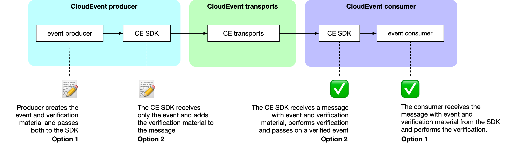

# Proposal: CloudEvents Verifiability

## Goals

This proposal introduces a transport protocol agnostic design for verifiable CloudEvents. It allows producers of CloudEvents to sign the events that they send—and consumers to cryptographically verify the *authenticity and the integrity* of the events that they receive. Through this process consumers can be sure that events were in fact produced by the claimed producer (authenticity), and that the events were received exactly as they were sent, and not modified in transit (integrity).

The threats addressed by this proposal are those of malicious actors impersonating CloudEvent producers and of malicious actors modifying messages in transit.

## Non-goals

This proposal only applies to individual events. It does not give consumers any guarantees about the completeness of the event stream or the order of events.

The threats of malicious actors removing or hiding items from the event stream as well as swapping their order are not addressed by this proposal. Neither are the possibilities of messages accidentally getting lost or delivered in the wrong order. Both can be addressed by producers through means of adding the necessary information inside the event payloads.

Further, this proposal only aims at *verifiability*. It does not aim to enable *confidentiality*. Consequently, it does not address the threat of unauthorized parties reading CloudEvents that were not meant for them.

## Constraints

We have set the following constraints for the proposed design:

**Verifiability must be optional:** This ensures that the additional burden of producing verification material and performing verification only applies when verifiability is desired, which is not always the case.

**The design must be backward compatible:** ** Backward compatibility ensures that producers can produce verifiable events without any knowledge about whether the consumers have been configured and are able to verify events. 

**The design must be algorithm agnostic:** Being agnostic to the specifics of the verification algorithm and protocol allows for different *verifiability implementations* of this design. Different circumstances might call for different implementations, and the design should account for that.

**The verification material must be contained in the same message as the event:** The design aims to be simple and robust, and so the verification material must be transported and delivered along with the event that it describes (and not in separate events or even through different channels).

## Design

Verifiability in CloudEvents consists of two steps:

1. The producer of an event adds verification material to the message
2. The consumer of an event may use the verification material to verify the authenticity and integrity of the event


The specifics of what the verification material looks like and how the verification is performed depend on the *verifiability implementation*.

For example, in a public/private key based implementation the producer of an event would add a signature based on their private key as the verification material, and the consumer of an event could use the corresponding public key to check the if the signature matches the event.

The flow looks like this:



*Option 1*: useful for verifiability implementations outside of the CE SDK. The CE SDK merely passes on messages and is not involved in producing verification material or performing verifications and has no knowledge about the secrets that the verification is based on (e.g. private keys). Appropriate for tools in a closed ecosystem like an enterprise with special requirements that are not suitable for the CE SDK.

*Option 2*: useful for verifiability implementations that are directly supported by the CE SDK. The CE SDK has to be provided with the secrets (e.g. private key for producer and public key for consumers) and will create the verification material on the producer side and also perform the verification on the consumer side. This is the appropriate choice for any type of tool that is used by other entities, for example open source.

In order to make this possible, we propose two new [OPTIONAL context attributes](https://github.com/cloudevents/spec/blob/main/cloudevents/spec.md#optional-attributes) for the CloudEvents core specification:

* `verificationmaterial`
    * Type: `String`
    * Description: the material that consumers can use to verify a CloudEvent. For example, the verification material could be a signature of the event based on a private key. Consumers would use the producers’ public key to verify the signature.
    * Constraints:
        * OPTIONAL
        * If present, must be base64 encoded
        * If present, a `verificationmaterialtype` attribute must also be present
* `verificationmaterialtype`
    * Type: `String`
    * Description: tells consumers of CloudEvents what type the verification material is of. This high level category is used by the consumer to choose an appropriate implementation for performing the verification. The verification material can contain information specific to the implementation such as a sub type, version information, etc.
    * Constraints:
        * OPTIONAL
        * If present, a `verificationmaterial` attribute must also be present
        * Producer and consumer must agree on an appropriate type

## Verifiability Implementations

While this proposal is agnostic to the specific implementations, we set the following rules for verifiability implementations:

A verifiability implementation **MUST**:

* transport the verification material in the same message as the event
* use the two relevant context attributes in this proposal

A verifiability implementation **SHOULD**:

* avoid depending on canonicalization (and its [unnecessarily large attack surface](https://github.com/secure-systems-lab/dsse/blob/master/background.md#motivation))
* transport the verification material detached from the event payload (this helps avoid canonicalization)

A verifiability implementation **MUST FAIL** on:

* Duplication of a relevant context attribute (e.g. two `verificationmaterial` attributes being set in a message)
* One relevant context attribute being present but the other missing (e.g. `verificationmaterial` being set but `verificationmaterialtype` missing)
* Unknown material type (e.g. the implementation may only attempt to use the verification material if it knows how to do so)
* Invalid material (e.g. the verification material did not match the received event)

In order to get a verifiability implementation into the official CloudEvents SDK, the following requirements are set.

## Verifiability Implementation Proposals

A proposal for adding a verifiability implementation to the CE SDK **MUST:**

* provide specs on how to implement verification
* provide test vectors
* provide a verification coverage table (see Verification coverage table)

Test vectors ensure that implementations are consistent which does NOT affect verifiability. 

## Example

To illustrate, let’s walk through how to implement a verification implementation CloudEvents provide test vectors as well as a verification coverage table.

### Verification Implementation

This is an example message containing a CloudEvent directly from the spec. It happens to be an HTTP structured mode message in JSON format. Our goal is to come up with the most insecure but also most concise verification implementation imaginable: one based on an md5 digest!

Here is how a message containing that CloudEvent might look:

```
content-length: 209
content-type: application/json

{
    "specversion" : "1.0",
    "type" : "com.example.someevent",
    "source" : "/mycontext",
    "subject": null,
    "id" : "D234-1234-1234",
    "time" : "2018-04-05T17:31:00Z",
    "data" : "I'm just a string"
}
```

In order to make this event verifiable, an md5 digest of the body of the message is computed: `dc98e72d0f9980e89af5f8e7692d58d7`. This value will then be base64 encoded and added as the `verificationmaterial` context attribute:

```
content-length: 209
content-type: application/json
ce-verificationmaterial: ZGM5OGU3MmQwZjk5ODBlODlhZjVmOGU3NjkyZDU4ZDc=
ce-verificationmaterialtype: md5

{
    "specversion" : "1.0",
    "type" : "com.example.someevent",
    "source" : "/mycontext",
    "subject": null,
    "id" : "D234-1234-1234",
    "time" : "2018-04-05T17:31:00Z",
    "data" : "I'm just a string"
}
```

A consumer then receives the this message and in order to verify, they must look at the `ce-erificationmaterialtype` header to determine whether it knows how to perform the verification. The consumer sees that verification material’s type is `md5`, so they will compute the `md5` of the payload to verify the CloudEvent contained in the message:

```
$ echo -n '{
      "specversion" : "1.0",
      "type" : "com.example.someevent",
      "source" : "/mycontext",
      "subject": null,
      "id" : "D234-1234-1234",
      "time" : "2018-04-05T17:31:00Z",
      "data" : "I\'m just a string"
  }' | md5sum
dc98e72d0f9980e89af5f8e7692d58d7  -
```

The consumer can then confirm that the `md5sum` output matches the verification material and conclude that the CloudEvent’s authenticity and integrity are “guaranteed“.

Now, since we want to make our fantasy verification implementation into a proposal to be included in the CE SDK, we will need to define test vectors and a verification coverage table.

### Test Vectors

An example test vector may look like:

```
[
    "input": {
        {
            "specversion" : "1.0",
            "type" : "com.example.someevent",
            "source" : "/mycontext",
            "subject": null,
            "id" : "D234-1234-1234",
            "time" : "2018-04-05T17:31:00Z",
            "data" : "I'm just a string"
        }
    },
    "expectedVerificationMaterialType": "md5",
    "expectedVerificationMaterial": "dc98e72d0f9980e89af5f8e7692d58d7"
]
```

SDKs and implementors can then use the vectors to ensure that any implementation is correct and verifiable across different languages and systems.

### Verification Coverage Table

The table below outlines which parts of a CloudEvent for our imaginary md5 based verification implementation would cover:

|Verifiable information	|binary-mode	|structured-mode	|comment	|
|---	|---	|---	|---	|
|data/payload	|✅	|✅	|	|
|mandatory context attributes	|❌	|✅	|The md5 verification implementation only looks at the payload, not at any headers.	|
|optional context attributes	|❌	|✅	|
|extension attributes	|❌	|✅	|

Again, `md5` was chosen because it makes for an easily readable example. It is wildly insecure and not suitable for actual verifiability. 

## Appendix

### Dictionary

* *event*: a CloudEvent
* *consumer*: a system that consumes CloudEvents
* *format*: a specific way to format messages, often depending on the transport
* *message*: an envelope that is used to transport a CloudEvent from its producer to the consumers
* *producer*: a system that produce CloudEvents
* *transport*: a system used to get CloudEvents from their producers to the consumers (e.g. HTTP, RabbitMQ, etc.)
* *verifiability implementation*: an implementation that makes CloudEvents verifiable according to the design in this proposal
* *verification material*: the material offered to consumers so they can perform the verification of an event
