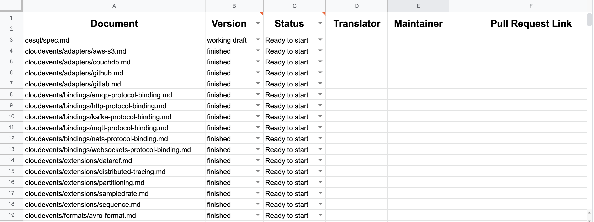

# Instructions for CloudEvents Specification in Multi-languages

<!-- no verify-specs -->

## Abstract

This page contains information about how to translate a document from scratch, definition of roles and responsibilities 
as well as guidelines that translators and maintainers should follow.

## Status of this document

This is a working draft. Changes could be made anytime.

## Table of Contents

- [Overview](#overview)
- [Roles](#roles)
- [How to translate](#how-to-translate)
- [Translation style guide](#translation-style-guide)

## Overview

We welcome you to join us and contribute to the CloudEvents spec!

CloudEvents is a specification for describing event data in common formats to provide interoperability across services, platforms and systems.
An increasing number of developers are becoming interested in CloudEvents.
We encourage you to translate the spec into a specific language since the language barrier might hinder the spread of CloudEvents.

This page contains information about how to translate a document from scratch, definition of roles and responsibilities
as well as guidelines that translators and maintainers should follow.

## Roles

There are two categories of roles:

1. **Translator.** This is anyone who participates in the translation of any
   CloudEvents documents. One becomes a formal translator once a Pull Request(PR) of his/her translation is merged.

2. **Maintainer.** A maintainer is responsible for checking new translation, 
   ensuring translation up to date as English version changed and answering related issues.
   See the [Maintainers](maintainers.md) for the current list of Maintainers.

### Translators

A Translator can start translate following [how to translate](#how-to-translate).

A translator should follow [translation style guide](#translation-style-guide).

### Maintainers

The following rules govern adding and removing maintainers:

- New maintainers can be proposed via a PR to edit the [maintainers](maintainers.md) file.
  Only probationary maintainers can be assigned as a formal maintainer. 
  A translator who completes at least 6 translation documents becomes a probationary maintainer automatically.
- Maintainers can be removed via a PR to edit the [maintainers](maintainers.md) file. That happens when a maintainer
  explicitly give up the role or has not performed maintainer duties over 2 weeks.

## How to translate

### Step 1. Check the Languages.md
First, fork [cloudevents/spec](https://github.com/cloudevents/spec/tree/main) to your Github repo. Then check the [languages.md](languages.md)
to see if the language you'd like to translate into already exists. 
If it exists, add new translation under `languages/$(your-language-code)/$(corresponding-position)`. 
For example:
```
cloudevents/spec.md should be translated as languages/zh-cn/cloudevents/spec.md
cloudevents/adapters/github.md should be translated as languages/zh-cn/cloudevents/adapters/github.md
*****NOTE: documents under languages directory should not be translated ***** 
```
If your language doesn't exist, add a new item to the [languages.md](languages.md) file, which links to a newly-created directory named after the corresponding
language code within [language codes](https://en.wikipedia.org/wiki/Language_localisation#Language_tags_and_codes). Then,
add new translation to right position as described above.

### Step 2. choose which document you'd like to translate
A translator can know about which documents are not translated yet by reading a "CE translation list".

The list looks like this:



- version: choose from {`finished`, `working draft`}; a translator should always start translate from `finished` documents since `working draft` might be changed anytime.
- status: choose from {`Ready to start`, `Started`, `PR reviewing`, `PR merged`}
    - Ready to start: any document is ready to be translated stay in this state. A translator set status as `Started` once he/she decides to translate it.
    - Started: indicating someone is translating this document. Translator and Maintainer field should be filled in once status is `Started`.
    - PR reviewing: a translator finished the translation, and the work is being reviewed. PR link should be filled in once status is `PR reviewing`.
    - PR merged: the translation is successfully merged in the spec. 
      
The file `languages/$(your-language-code)/translate.md` will hold the link of the "CE translation list".

If the file `languages/$(your-language-code)/translate.md` doesn't exist, then you should:

- Copy [translate-sample.md](translate-sample.md) to `languages/$(your-language-code)/translate.md`
- Copy the "CE translation sample list" and create a new one for you. Then replace the sample sheet link with the new sheet link you just created.
- Change the access right to "Anyone on the internet with this link can edit" so that every potential translator could directly choose a document to translate.
- It doesn't matter which language you're using to write `languages/$(your-language-code)/translate.md`. However, it must contain the link of the "CE translation list" with access right as "everyone can edit".

### Step 3. submit your translation
A translator must submit translation via submitting a Pull Request. See details in how to [submit a Pull Request](../community/CONTRIBUTING.md#suggesting-a-change).

## Translation style guide
- Only translate textual documents(generally md files). Other format documents(.json, .yaml, .g4) will not be translated.
- Always start translate from `finished` documents since `working draft` might be changed anytime.
- Code blocks within md documents are not translated.
- Well-known technical terms ("JSON", "HTTP", "SDK", "Kafka", etc) are not translated.
- Always add a space between an English word and other language word.